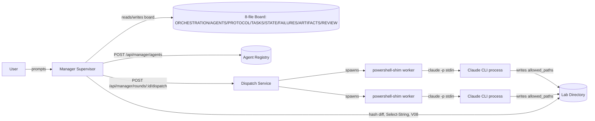
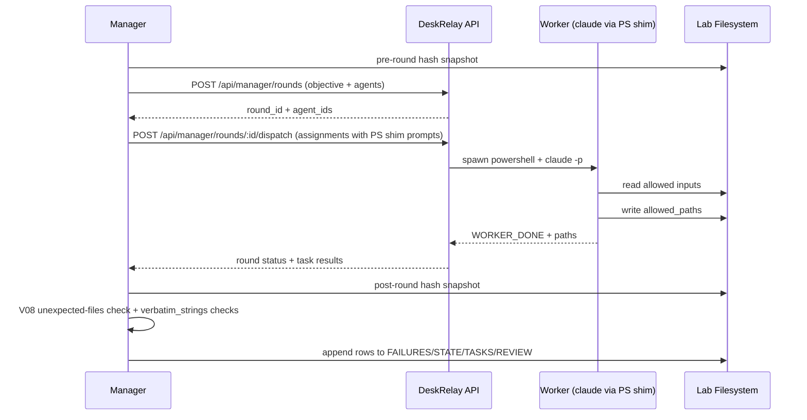

# ARCHITECTURE

Operational map of the orchestration lab. A new manager should read this before
ORCHESTRATION.md to understand which moving parts exist, who owns what, and how
one round flows through the system. ORCHESTRATION.md is the charter; this file
is the wiring diagram.

## Layers

The lab is built from three distinct layers. Each has a narrow responsibility
and must not impersonate another.

- Manager layer. The current Claude session acting as supervisor. Reads state,
  plans the next round, authors delegation prompts, runs independent
  verification, and appends bookkeeping rows. The manager never authors
  substantive artifacts; it only coordinates.
- Agent layer. Role personas created through the DeskRelay manager API at
  POST /api/manager/agents. An agent is a named prompt profile (for example
  claude-code worker R2 architect) that the manager binds to a worker for one
  round. Agents carry the role description and policy; they do not run code on
  their own.
- Worker layer. Concrete CLI runtimes that actually execute commands and write
  files. Two profiles exist today: a native claude-code profile that launches
  the Claude CLI in stream-json mode, and a powershell-profile worker that
  shells out via PowerShell. Workers are the only layer that authors
  substantive artifacts.

Rule of thumb: the manager coordinates, agents describe the role, workers do
the work.

## File Ownership

Every lab artifact falls into one of three ownership classes mirroring the
ARTIFACTS.md catalog. There are no shared-write files at present; any future
overlap is authorised through a LOCKS.md row.

The **manager-only bookkeeping** group is the append-only ledger and snapshot
surface the manager rewrites in response to round outcomes; workers must never
edit these.

- TASKS.md    - append-only task queue updated at round open.
- STATE.md    - round snapshot, rewritten at round close.
- FAILURES.md - failure log keyed by layer label.
- REVIEW.md   - per-round rubric scores.

The **board** group is the worker- and manager-authored canonical orchestration
files the manager loads at every round open; these are the contract surface
every dispatch reads.

- ORCHESTRATION.md - lab charter and round loop.
- AGENTS.md        - actor definitions and per-role forbidden actions.
- PROTOCOL.md      - delegation contract and worker prompt schema.
- ARTIFACTS.md     - authoritative artifact catalog (owner, status, provenance).

The **reference** group is the worker-authored extras read on demand for
context, recipes, audits, or post-mortems rather than at every round open.

- ARCHITECTURE.md   - this file; wiring diagram for new managers.
- VERIFICATION.md   - V01..V0N verification snippet library.
- CRITIQUE.md       - R2 critic pass over the R1 scaffolding.
- RECORDS.md        - append-only chronological record across rounds.
- INCORPORATION.md  - CRITIQUE.md prioritisation pass with P1/P2/P3 backlog.
- DIAGNOSTICS.md    - verifier-as-diagnostician report (R4 site-server restart).
- UPTIME-PROBE.md   - pre-dispatch uptime probe procedure and template.
- LOCKS.md          - cross-round path-lock registry (header schema, dormant).
- PROJECT.md        - sample-project context (Reflex Tap); not the deliverable.
- REVIEWER-NOTES.md - R6 R2' board-vs-extras and cross-document audit.

Rationale. Bookkeeping files are append-mostly and need a single writer to
remain auditable; board files codify the contract every dispatch consults and
must be readable in a single sweep; reference files are deeper artifacts whose
prose is too long to load every round but is load-bearing when a specific
question (verification recipe, prior critique, failure post-mortem) arises.

## Round Lifecycle

A round threads through DeskRelay manager API endpoints in this order. Each
step lists the endpoint the manager hits and the local artifacts touched.

1. Observe. Read STATE.md, TASKS.md, FAILURES.md, REVIEW.md, and any sample
   workspace state. Endpoint: GET /api/manager/system/summary to confirm
   server reachability and Claude CLI version. No artifact mutation.
2. Pre-snapshot. Compute SHA256 of every file under the working directory and
   record it locally. This is what post-round verification diffs against. No
   endpoint call.
3. Agent creation. For each role needed this round, create or reuse an agent
   profile. Endpoint: POST /api/manager/agents. The agent carries role prose;
   it does not yet have allowed_paths.
4. Dispatch. Open a round and assign one or more agents to workers with
   per-assignment allowed_paths and the full PROTOCOL.md-shaped prompt body.
   Endpoints: POST /api/manager/rounds (create), POST
   /api/manager/rounds/:id/dispatch (assign and start workers).
5. Observe workers. Stream output and lifecycle events for each running task.
   Endpoint: GET /api/manager/tasks/:id/stream (server-sent events). The
   manager does not write while a worker is live.
6. Verify. After each worker reports WORKER_DONE, run the verification
   commands declared in that worker's prompt: existence, line-count bound,
   Select-String for verbatim tokens, hash diff against pre-snapshot to
   confirm the worker stayed inside allowed_paths.
7. Bookkeeping. Append to TASKS.md, FAILURES.md (with a layer label if any
   verification failed), REVIEW.md (one row scoring this round), and rewrite
   STATE.md.
8. Report. Close the round. Endpoint: POST /api/manager/rounds/:id/report
   with the bookkeeping deltas and any protocol_delta linked from a failure.

## Worker Profile Shim

The native DeskRelay claude-code worker profile is currently broken (see
FAILURES.md F2). The server's manager-assistant launcher in
packages/site-backend/src/app.ts appends --input-format stream-json to the
spawned claude invocation but never appends the matching --output-format
stream-json, and Claude CLI 2.1.140 rejects that pairing.

Until F2 is patched, the manager dispatches a powershell-profile worker as a
shim. The shim works as follows:

- The manager writes the worker prompt body to a local instruction file (for
  example C:\Users\darkh\Projects\orchestration-lab\.dispatch\R2-arch.txt).
- The agent prompt is a single PowerShell line that pipes that file into the
  Claude CLI with permissions bypassed, for example:
  Get-Content .dispatch\R2-arch.txt | claude -p --permission-mode
  bypassPermissions
- The Claude CLI runs in its default interactive output format, sidestepping
  the stream-json pairing bug. Output is captured by the powershell worker
  and surfaced via /api/manager/tasks/:id/stream as normal.

R2 still uses this shim for all substantive authoring, including this file. A
future round will patch app.ts (or set DESKRELAY_MANAGER_WORKER_CLAUDE_ARGS),
re-run a dispatch through the native claude-code profile to confirm the fix,
and then retire the shim.

## Failure Layers and Failure Routing

FAILURES.md defines a fixed layer legend. Every failure row must carry one of
these labels so that the manager can spot recurring weaknesses and route the
fix to the right place. Concrete examples in this lab:

- server. The DeskRelay manager API at /api/manager/system/summary returns 500
  while Claude CLI itself is healthy.
- connector. The SSE stream from /api/manager/tasks/:id/stream drops mid-round
  and the manager loses worker output.
- daemon. A required local background service the CLI depends on is not
  running.
- Claude CLI. The CLI crashes or returns a non-zero exit code unrelated to
  prompt content (for example a panic in stream-json parsing).
- worker CLI. F2: app.ts spawns claude with mismatched stream-json flags so
  the worker fails before reading its prompt.
- workspace. A worker writes outside allowed_paths or a required directory is
  missing.
- permission. Bypass mode is not granted and the worker is blocked from a
  legitimate action.
- network. DNS, proxy, or TLS prevents the Claude CLI from reaching the
  upstream server.
- repository. Git state is missing or divergent in a way the prompt assumed
  away.
- protocol. A rule in PROTOCOL.md is too vague to disambiguate a real case
  the manager faced.
- prompt. F1: the dispatch prompt named a Korean string without marking it
  verbatim and the worker paraphrased a synonym.
- verification. The manager skipped or wrote the wrong post-check and a
  mutation went unverified.

Routing rule. A protocol or prompt layer failure forces an edit to PROTOCOL.md
in the same round and a protocol_delta entry in the failure row. Other layers
route to the named subsystem (server, connector, CLI flags, etc.) without
necessarily touching PROTOCOL.md.

## Concurrency and Disjoint Writes

Multiple workers can run in one round, but the lab has no transactional file
locking yet. Safety is enforced by three overlapping conventions.

- Allowed_paths discipline. Every dispatch declares an explicit allowed_paths
  list. The manager refuses to assign two live workers whose allowed_paths
  intersect unless a LOCKS.md row authorizes the overlap.
- Pre-snapshot hashing. Before dispatching, the manager hashes every file in
  the working directory. After each worker reports, the manager re-hashes and
  rejects any change to a file outside the worker's allowed_paths as a
  workspace-layer failure.
- LOCKS.md, once introduced. Rows of the form
  | path | owner_task | round | expires_after | mark long-lived ownership
  across rounds. A worker reads LOCKS.md before writing and refuses to write
  a path it does not own.

Current limitation. Enforcement is post-hoc, not transactional. A misbehaving
worker can still write to a forbidden path during its run; the manager only
detects the violation at verification time and logs it. Tightening this into
true mediation (for example a write-proxy or a file-system sandbox per
worker) is a candidate framework improvement for a later round.

## System Layers Diagram

## Round Lifecycle Diagram

