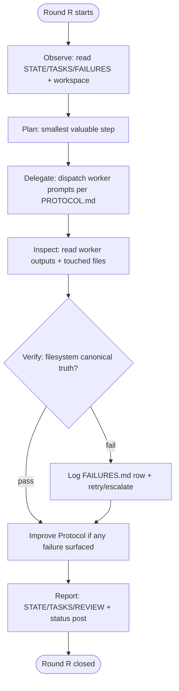

# ORCHESTRATION

Charter for the orchestration framework lab. A manager supervises multiple Claude CLI workers that share a single project directory safely. The sample project under PROJECT.md is only a validation vehicle; shipping it is not the goal.

## Primary Goal

Build a manager/worker framework - not the sample game - that scales to multiple concurrent workers without overlapping writes, undetected failures, or silent drift. The protocol improves every round based on observed failures.

Measurable target: a manager can dispatch N workers across disjoint paths and verify outputs in <T minutes without manual transcript reads.

## Round Loop

The manager runs each round in this fixed order (see diagram below):

1. Observe  - read STATE/TASKS/FAILURES and workspace state.
2. Plan     - decide the smallest valuable next step that exercises the framework.
3. Delegate - dispatch worker prompts following PROTOCOL.md.
4. Inspect  - independently read worker outputs and touched files.
5. Verify   - run verification commands declared in each worker prompt.
6. Improve Protocol - if any failure surfaced, update PROTOCOL.md and FAILURES.md.
7. Report   - update STATE.md, TASKS.md, REVIEW.md for the round.

## Round Loop Diagram

## Operating Principle

관리자는 직접 구현하지 않는다

The manager does not implement directly.

Direct manager writes are bounded by `manager_direct_edits_max` in spec.json (see PROTOCOL.md).

## Artifacts the Manager Reads Every Round

- ORCHESTRATION.md (this file)  - charter and round loop.
- AGENTS.md                     - role definitions.
- PROTOCOL.md                   - delegation contract.
- TASKS.md                      - work queue.
- STATE.md                      - current snapshot.
- FAILURES.md                   - failure log.
- ARTIFACTS.md                  - file catalog.
- REVIEW.md                     - rubric and round scores.

Reference docs (ARCHITECTURE, VERIFICATION, etc.) are consulted only when the round's intent requires them.

## Where Things Live

| concern | source of truth |
| --- | --- |
| delegation contract & verification rules | PROTOCOL.md |
| roles, good/bad output per role | AGENTS.md |
| failure log, retry budget | FAILURES.md |
