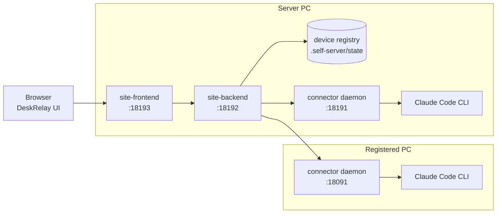

# DeskRelay

DeskRelay는 내 PC에서 실행되는 Claude Code를 브라우저에서 제어하는 self-host 개발 도구입니다. 서버 PC 한 대를 띄우고, 같은 LAN 또는 Tailscale 안의 다른 PC를 디바이스로 등록해서 씁니다.

공용 인터넷에 connector 포트를 직접 노출하지 마세요. 외부에서 접근해야 하면 Tailscale 같은 사설 네트워크를 사용하세요.

화면별 사용 설명은 [매뉴얼](docs/MANUAL.md)을 확인하세요.

## 구조



## 필요 조건

- 서버 PC: Windows PowerShell 또는 macOS Terminal
- Claude Code CLI가 사용할 PC에 로그인되어 있어야 함
- 다른 PC를 등록하려면 같은 LAN 또는 같은 Tailscale tailnet
- Git/Bun이 없으면 서버 설치 명령이 가능한 범위에서 자동 설치를 시도함

## 서버 설치

### Windows

PowerShell에 붙여넣습니다.

```powershell
$ErrorActionPreference = 'Stop'
$installer = Join-Path $env:TEMP 'deskrelay-install-server.ps1'
Invoke-WebRequest -UseBasicParsing -Uri 'https://raw.githubusercontent.com/darkhtk/deskrelay/main/scripts/install-server.ps1' -OutFile $installer
powershell -ExecutionPolicy Bypass -File $installer -WithTailscale
```

LAN 안에서만 쓸 거라면 `-WithTailscale`을 빼도 됩니다.

### macOS

Terminal에 붙여넣습니다.

```bash
curl -fsSL https://raw.githubusercontent.com/darkhtk/deskrelay/main/scripts/install-server-macos.sh -o /tmp/deskrelay-install-server-macos.sh
bash /tmp/deskrelay-install-server-macos.sh --with-tailscale
```

LAN 안에서만 쓸 거라면 `--with-tailscale`을 빼도 됩니다. macOS 서버 스크립트는 현재 백그라운드 프로세스로 서버를 띄웁니다.

설치가 끝나면 기본 브라우저가 `http://127.0.0.1:18193`으로 열립니다.

## 접속 URL과 토큰

Windows 서버에서 상태를 확인합니다.

```powershell
Set-Location -LiteralPath (Join-Path $HOME 'deskrelay')
powershell -ExecutionPolicy Bypass -File .\scripts\self-pc-server-status.ps1
```

다른 기기에서 접속할 때는 `DESKRELAY-SERVER-CODE.txt` 또는 `.self-server\commands` 안의 URL을 사용하세요. `#site-token=...`이 포함된 URL이면 토큰 입력 없이 들어갑니다.

## 다른 PC 등록

1. 서버 PC에서 DeskRelay를 엽니다.
2. 메인 화면의 `다른 PC 등록 명령`을 통째로 복사합니다.
3. 제어하려는 Windows PC의 PowerShell에 붙여넣습니다.
4. 스크립트가 repo 설치/업데이트, connector 실행, Tailscale/LAN 주소 감지, 서버 접근 검증, 디바이스 등록을 처리합니다.
5. 성공하면 서버의 디바이스 목록에 새 PC가 나타납니다.

등록된 PC의 connector 기본 포트는 `18091`입니다.

## 사용

- 왼쪽 디바이스 드롭다운에서 사용할 PC를 고릅니다.
- `+`로 새 채팅을 시작하고 작업 디렉토리를 선택합니다.
- 세션 탭에서 기존 Claude 세션을 엽니다.
- 권한 탭에서 현재 디바이스/세션의 권한을 확인하고 조정합니다.
- 지침 탭에서 현재 세션 작업 폴더의 Claude 지침 파일을 확인하고 편집합니다.
- 스킬 탭에서 사용 가능한 스킬과 슬래시 명령을 확인합니다.
- 설정에서 디바이스 관리, 업데이트, 연결 진단, 표시 옵션을 다룹니다.

## 업데이트

앱 안에서는 `설정 -> 일반 -> 전체 업데이트`를 사용합니다.

서버만 터미널에서 업데이트하려면:

```powershell
Set-Location -LiteralPath (Join-Path $HOME 'deskrelay')
powershell -ExecutionPolicy Bypass -File .\scripts\self-pc-server-update.ps1
```

다른 PC의 connector가 오래되었으면 해당 PC에서 등록 명령을 다시 실행하는 것이 가장 확실합니다.

## 중지와 제거

서버 중지:

```powershell
Set-Location -LiteralPath (Join-Path $HOME 'deskrelay')
powershell -ExecutionPolicy Bypass -File .\scripts\self-pc-server-stop.ps1
```

서버 상태 제거:

```powershell
Set-Location -LiteralPath (Join-Path $HOME 'deskrelay')
powershell -ExecutionPolicy Bypass -File .\scripts\self-pc-server-uninstall.ps1
```

설치 폴더까지 지우려면 `-RemoveRepo`를 붙입니다.

## 문제 해결

### 스크립트 실행이 막힘

```powershell
powershell -ExecutionPolicy Bypass -File .\scripts\self-pc-server-start.ps1
```

### 디바이스가 목록에 안 뜸

- 등록 명령의 서버 URL이 `127.0.0.1`이 아닌 LAN/Tailscale URL인지 확인
- 대상 PC가 같은 LAN 또는 같은 Tailscale tailnet 안에 있는지 확인
- 서버 PC에서 대상 PC의 `18091` 포트에 접근 가능한지 확인
- 대상 PC 방화벽이 inbound TCP `18091`을 막고 있지 않은지 확인
- 기존 connector가 포트를 점유하고 있으면 종료 후 등록 명령 재실행

### `outside the configured workspace roots`

현재 디바이스의 허용된 workspace roots 밖을 열려고 한 것입니다. 설정에서 새 채팅 작업 폴더 탐색 제한을 조정하거나, 해당 PC의 `CR_CONNECTOR_WORKSPACE_ROOTS`를 원하는 루트로 바꾼 뒤 connector를 재시작하세요.

### 서버 포트가 이미 사용 중

기본 포트는 `18191`, `18192`, `18193`입니다.

```powershell
Get-NetTCPConnection -LocalPort 18191,18192,18193 -State Listen |
  Select-Object LocalPort, OwningProcess
```

필요하면 점유 프로세스를 종료합니다.

```powershell
taskkill /PID <OwningProcess> /T /F
```

## 개발

```powershell
bun install
bun run test:selfhost-docs
bun run test:selfhost-failures
bun run test:selfhost-virtual
```

## 라이선스

Apache-2.0. 자세한 내용은 [LICENSE](LICENSE)를 확인하세요.
