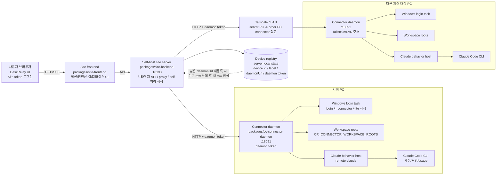
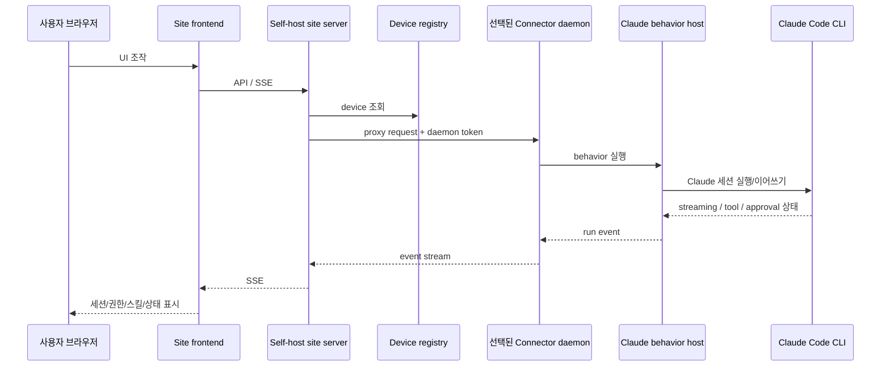
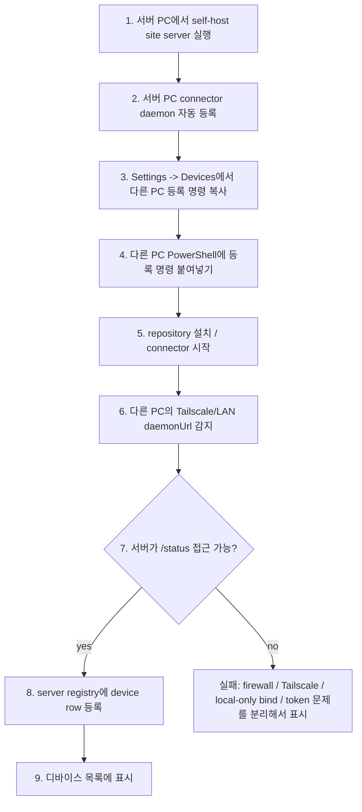
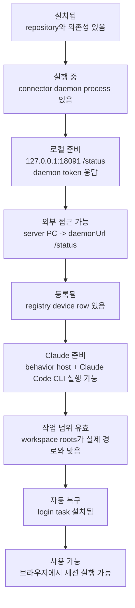

# DeskRelay

DeskRelay는 자기 PC에서 실행 중인 Claude Code를 브라우저로 조작하기 위한 self-host 오픈소스 도구다. 출시용 SaaS가 아니라, 파워유저가 자기 장비 안에 띄워 두는 control plane에 가깝다.

## 서버 PC 설치

서버로 쓸 Windows PC의 PowerShell에 아래 명령을 통째로 붙여넣는다. 기본 설치 위치는 `$HOME\deskrelay`이고, 실행 상태와 Site token은 `.self-server` 아래에 생성된다.

```powershell
$ErrorActionPreference = 'Stop'

$repo = Join-Path $HOME 'deskrelay'
if (-not (Test-Path -LiteralPath $repo)) {
  git clone https://github.com/darkhtk/deskrelay.git $repo
} elseif (-not (Test-Path -LiteralPath (Join-Path $repo '.git'))) {
  throw "Path exists but is not a git repo: $repo"
}

Set-Location -LiteralPath $repo
git pull --ff-only
bun install
powershell -ExecutionPolicy Bypass -File .\scripts\self-pc-server-start.ps1
```

실행이 끝나면 `http://127.0.0.1:18193`이 기본 브라우저로 열린다. 터미널에는 접속 URL, Site token, command 파일 위치가 출력된다. 같은 정보는 저장소 최상위의 `DESKRELAY-SERVER-CODE.txt`와 `REGISTER-OTHER-PC.txt`에도 생성된다.

서버를 중지하려면:

```powershell
Set-Location -LiteralPath (Join-Path $HOME 'deskrelay')
powershell -ExecutionPolicy Bypass -File .\scripts\self-pc-server-stop.ps1
```

다른 PC에서 접속하려면 서버 PC와 대상 PC가 같은 LAN 또는 Tailscale tailnet에 있어야 한다. connector 포트를 공용 인터넷에 직접 노출하지 않는다.

## 구조 노드



## 연결 그래프



## 등록 흐름



## 신뢰 기준

등록됐다는 것과 쓸 수 있다는 것은 다르다. DeskRelay가 믿을 수 있으려면 최소한 아래 조건을 분리해서 확인해야 한다.



## 파워유저 관점의 핵심 목표

- 같은 설치/등록 명령을 여러 번 실행해도 상태가 망가지지 않아야 한다.
- 실패하면 어느 노드에서 실패했는지 보여줘야 한다.
- 서버와 connector가 서로 접근 가능한지 등록 전에 검증해야 한다.
- token mismatch, local-only bind, firewall, Tailscale 미연결을 하나의 오프라인으로 뭉개면 안 된다.
- UI는 예쁜 온보딩보다 현재 노드 상태와 복구 액션을 보여줘야 한다.
