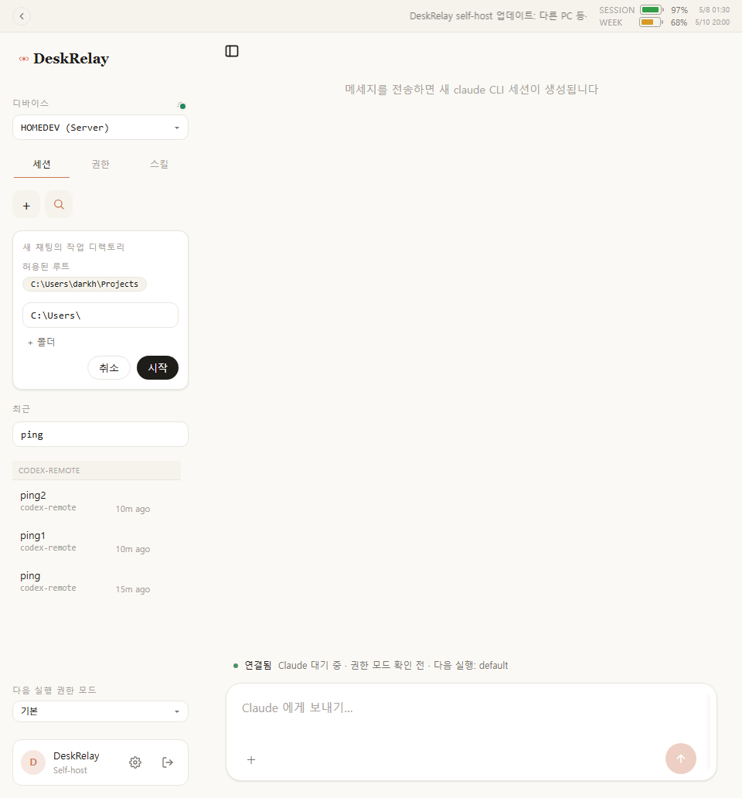
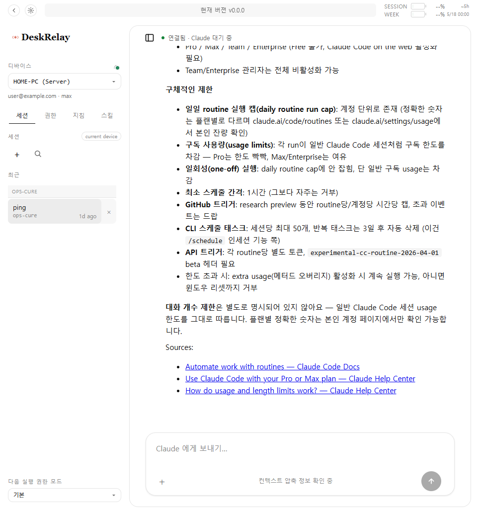
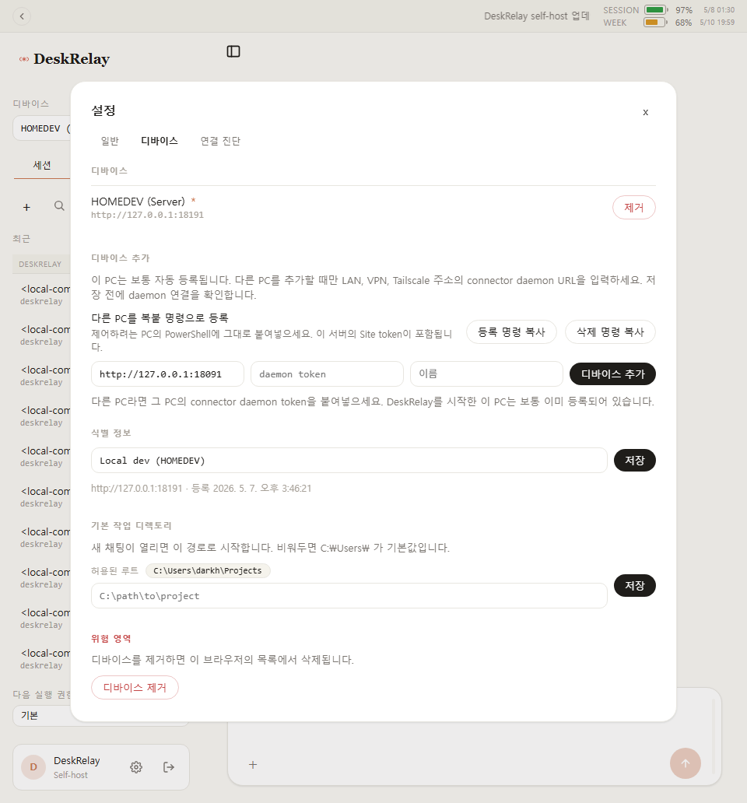
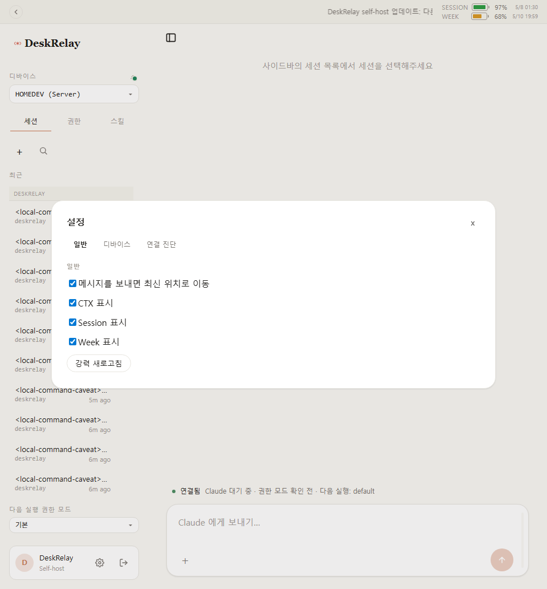
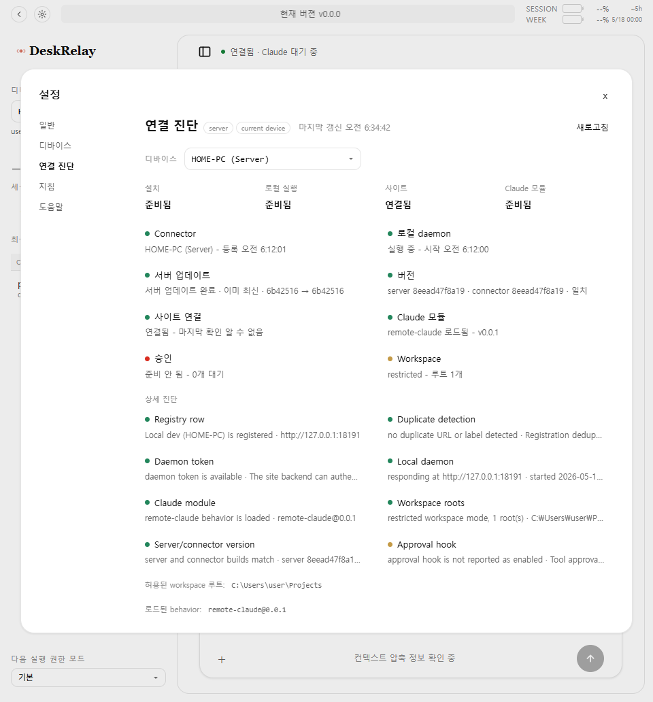
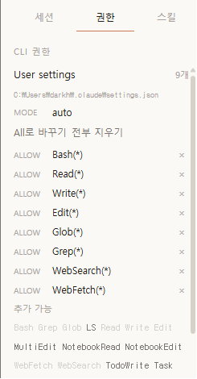
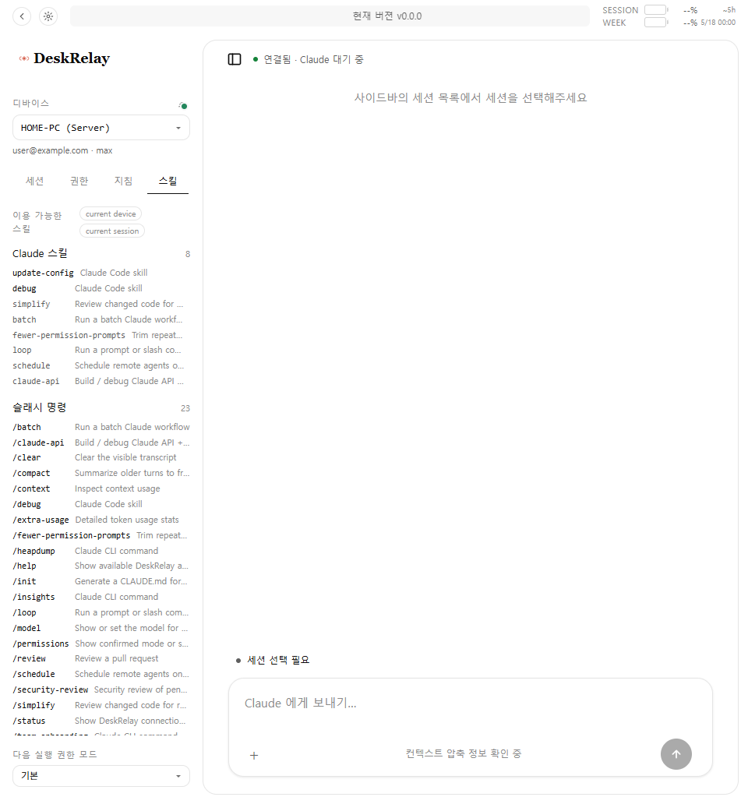

# DeskRelay

내 PC에서 실행되는 `claude` CLI를 브라우저에서 원격으로 조작하는 오픈소스 도구입니다.

DeskRelay는 호스팅 상품이 아닙니다. 공개 서비스 계정, 결제 플로우, 앱스토어 패키지, 중앙 릴레이 없이 각 사용자가 자기 PC에서 직접 실행하는 self-host 도구입니다. 사용자는 이 PC에서 DeskRelay를 실행하면 바로 이 PC의 Claude CLI를 브라우저에서 사용할 수 있고, 필요하면 다른 PC의 connector daemon URL을 디바이스로 추가 등록합니다.

## 제공하는 것

| 필요 | DeskRelay가 하는 일 |
|---|---|
| Claude Code 원격 사용 | 브라우저에서 내 PC의 `claude` CLI로 프롬프트를 보냅니다. |
| 여러 PC 관리 | 여러 connector daemon URL을 등록하고 사이드바에서 전환합니다. |
| 작업 로컬 유지 | 파일, 셸 명령, git, MCP 설정, Anthropic 인증 정보는 daemon이 실행되는 PC에 남습니다. |
| 세션 이어가기 | 기존 Claude 세션 파일을 보고, 이어서 대화하거나, 원하는 폴더에서 새 세션을 시작합니다. |
| 도구 사용 검토 | Claude의 도구 호출을 브라우저에서 승인하거나 거부합니다. |
| 생성 이미지 보기 | 선택한 작업 폴더의 지원되는 이미지 파일을 채팅 화면에서 미리 봅니다. |
| 연속 지시 큐잉 | Claude가 응답 중이어도 컴포저에 다음 지시를 계속 보낼 수 있고, 입력한 순서대로 처리됩니다. |

## 화면 미리보기

### 새 채팅과 작업 폴더 선택



### 세션 화면과 사용량 표시



### 연속 지시 큐잉

Claude가 이전 지시를 처리하는 동안에도 컴포저에서 다음 지시를 이어서 보낼 수 있습니다. DeskRelay는 연속 입력을 큐에 올리고, Claude CLI가 준비되는 순서대로 그대로 답을 받습니다.


### 디바이스 등록과 설정



### 표시 설정과 연결 진단

<p>
  
  
</p>

### 권한과 스킬

<p>
  
  
</p>

## 요구 사항

- Git
- [Bun](https://bun.sh)
- 제어하려는 모든 PC에 [Claude Code CLI](https://docs.claude.com/en/docs/claude-code) 설치 및 인증 완료
- DeskRelay 사이트 백엔드가 각 connector daemon에 접근할 수 있는 사설 네트워크 경로

같은 LAN 안에서만 쓸 거라면 별도 VPN 없이 사용할 수 있습니다. 집 밖, 회사 밖, 모바일 네트워크처럼 LAN 밖에서 접속하려면 먼저 [Tailscale](https://tailscale.com)을 설치해 PC들을 같은 사설 네트워크에 넣으세요. connector daemon을 공용 인터넷에 직접 노출하지 마세요.

## 권장 사용 모델

DeskRelay self 버전은 중앙 SaaS가 아니라 사용자별 self-host 도구입니다.

각 사용자는 자기 PC 한 대에서 DeskRelay를 실행합니다. 그 PC의 Claude CLI는 기본 디바이스로 자동 등록되고, 다른 PC의 Claude CLI도 쓰고 싶을 때만 추가 디바이스를 등록합니다.

```text
사용자 A의 DeskRelay PC
- A의 site-frontend
- A의 site-backend
- A PC의 connector daemon
- A가 추가 등록한 다른 PC connector daemon들

사용자 B의 DeskRelay PC
- B의 site-frontend
- B의 site-backend
- B PC의 connector daemon
- B가 추가 등록한 다른 PC connector daemon들
```

이 구조에서는 별도 가입, 중앙 계정, 결제, 앱스토어 배포, 중앙 릴레이가 필요 없습니다. 외부 접속은 Tailscale 같은 사설 VPN을 권장합니다.

## 설치

서버로 쓸 PC에서 한 번만 실행합니다.

```powershell
git clone https://github.com/darkhtk/deskrelay.git
cd deskrelay
bun install
powershell -ExecutionPolicy Bypass -File .\scripts\self-pc-server-start.ps1
```

명령이 끝나면 접속 URL과 `Site token`이 출력됩니다. 같은 PC에서는 `http://127.0.0.1:18193`을 열고 `앱 열기`를 누르면 바로 들어갈 수 있습니다. 다른 PC나 휴대폰에서 접속하려면 출력된 Tailscale/LAN URL을 열고 `Site token`을 입력하세요.

서버 PC의 Claude CLI는 자동으로 디바이스에 등록됩니다.

## 다른 PC 등록

서버 PC의 DeskRelay 폴더에 생성된 `REGISTER-OTHER-PC.txt`를 엽니다.

```powershell
notepad .\REGISTER-OTHER-PC.txt
```

그 안의 내용을 제어하고 싶은 다른 PC의 PowerShell에 통째로 붙여넣습니다. 그러면 그 PC에서 다음 작업이 자동으로 진행됩니다.

- `$HOME\deskrelay` 설치 또는 업데이트
- 기존 폴더 상태가 이상하면 백업 후 새로 clone
- connector daemon을 `0.0.0.0:18091`로 로그인 작업 등록 및 실행
- 서버 URL에 맞는 Tailscale 또는 LAN 주소 감지
- 서버에서 해당 connector URL에 접근 가능한지 검증
- 서버의 디바이스 목록에 자동 등록

등록이 끝나면 브라우저의 디바이스 목록에 새 PC가 나타납니다.

서버 URL이 Tailscale 주소라면 등록 대상 PC도 같은 tailnet에 로그인되어 있어야 합니다. 명령은 Tailscale IPv4를 자동으로 찾아 사용하고, 없으면 설치/로그인 후 다시 실행하라는 오류를 냅니다.

## 자주 쓰는 명령

서버 중지:

```powershell
powershell -ExecutionPolicy Bypass -File .\scripts\self-pc-server-stop.ps1
```

서버 상태와 URL/token 다시 보기:

```powershell
powershell -ExecutionPolicy Bypass -File .\scripts\self-pc-server-status.ps1
```

`Site token`은 `.self-server\site-token.txt`와 `DESKRELAY-SERVER-CODE.txt`에도 저장됩니다. 이 파일들은 비밀번호처럼 다루세요.

더 많은 복붙용 명령은 `.self-server\commands\`에 생성됩니다.

## 외부 접속

외부에서 쓰려면 Tailscale을 설치하세요. 포트포워딩으로 DeskRelay를 공용 인터넷에 직접 공개하는 방식은 권장하지 않습니다.

Tailscale 사용 순서:

1. DeskRelay를 실행한 이 PC와 접속할 기기에 Tailscale을 설치합니다.
2. 같은 Tailscale 계정 또는 같은 tailnet으로 로그인합니다.
3. 이 PC에서 `self-pc-server-status.ps1`를 실행해 Tailscale URL을 확인합니다.
4. 외부 기기의 브라우저에서 그 URL로 접속하고 `Site token`으로 로그인합니다.

고급 설정, SSH 관리, 수동 connector 실행은 [고급 사용 문서](docs/advanced.md)를 참고하세요. 로컬 개발용 스택은 [개발 문서](docs/development.md)를 참고하세요.

## 보안 모델

DeskRelay는 내 머신을 원격으로 조작하는 표면입니다. 개발자용 관리 도구처럼 다루세요.

- connector daemon은 Claude Code가 실행할 수 있는 파일 읽기와 명령 실행을 수행할 수 있습니다.
- 브라우저 승인 UI는 도구 사용 검토를 돕지만, sandbox가 아닙니다.
- daemon은 `127.0.0.1` 또는 사설 VPN/LAN 인터페이스에 바인딩하세요.
- 원격 사용 전 접근 가능한 작업 폴더를 제한하는 편이 안전합니다.
- 네트워크 전체가 사설이고 신뢰 가능한 경우가 아니라면 강한 `CR_SITE_TOKEN`을 사용하세요.
- `18091` 또는 `18092`를 공용 인터넷에 직접 노출하지 마세요.

## 개인정보와 이용약관

DeskRelay self는 호스팅 서비스가 아니라 사용자가 직접 실행하는 소프트웨어입니다. 따라서 프로젝트 관리자는 일반적인 self-host 설치에서 채팅, 프롬프트, Claude 응답, 파일, 명령 결과, 디바이스 목록, Site token, daemon token, 로그를 받거나 저장하지 않습니다.

주요 데이터 위치는 다음과 같습니다.

- Site token과 UI 설정: 브라우저 localStorage
- 디바이스 등록 정보: 사용자가 실행한 site-backend의 로컬 상태
- daemon token과 connector 상태: connector가 실행되는 PC
- Claude Code 세션 파일, 작업 폴더, git 상태, MCP 설정, Anthropic 인증 정보: connector가 실행되는 PC
- `.self-server\commands\` 명령 파일: 이 PC에서 쓰는 복붙용 파일이며 Site token이 포함될 수 있음

앱 안의 `/privacy`와 `/terms` 페이지도 self-host 기준으로 작성되어 있습니다. 이 저장소에는 가입, 결제, 앱스토어 배포, 중앙 릴레이 같은 호스팅 서비스 전제가 없습니다.

## 라이선스

메인 프로젝트는 Apache-2.0입니다. [LICENSE](LICENSE)를 확인하세요.

Claude와 Claude Code는 Anthropic PBC의 상표입니다. DeskRelay는 Anthropic과 제휴하지 않은 독립 오픈소스 프로젝트입니다.
