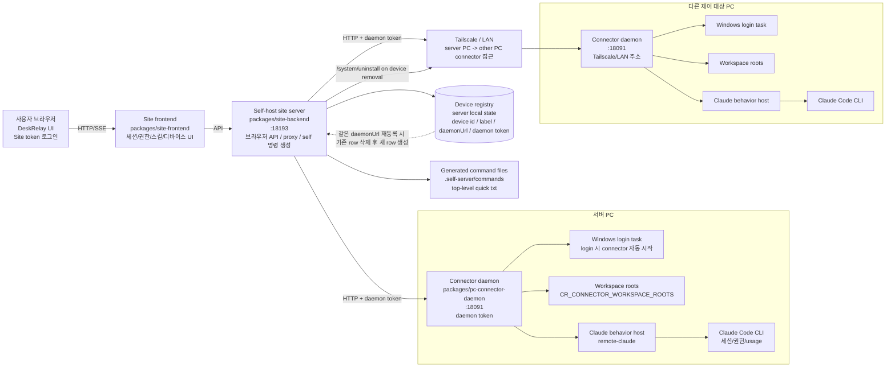
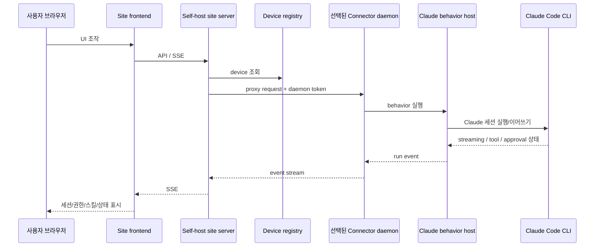
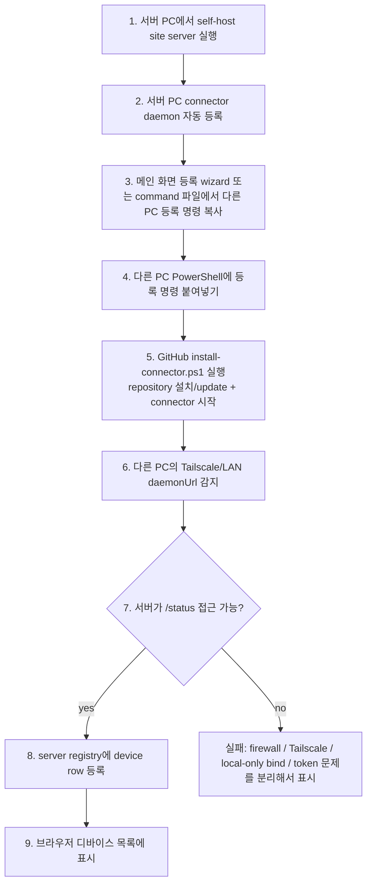
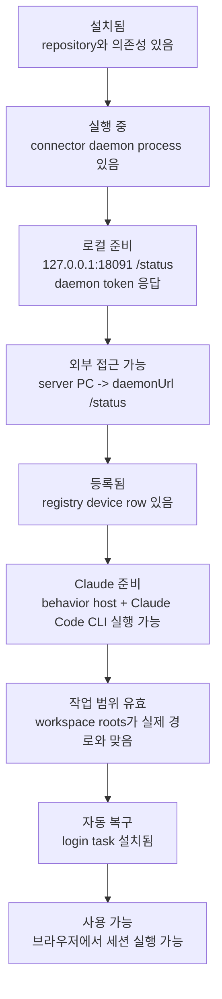

# DeskRelay

DeskRelay는 자기 PC에서 실행 중인 Claude Code를 브라우저로 조작하기 위한 self-host 오픈소스 도구다. 출시용 SaaS가 아니라, 파워유저가 자기 장비 안에 띄워 두는 control plane에 가깝다.

## 서버 PC 설치

서버로 쓸 Windows PC의 PowerShell에 아래 명령을 통째로 붙여넣는다. 기본 설치 위치는 `$HOME\deskrelay`이고, 실행 상태와 Site token은 `.self-server` 아래에 생성된다.

```powershell
$ErrorActionPreference = 'Stop'

$repo = Join-Path $HOME 'deskrelay'
if (-not (Test-Path -LiteralPath $repo)) {
  git clone https://github.com/darkhtk/deskrelay.git $repo
} elseif (-not (Test-Path -LiteralPath (Join-Path $repo '.git'))) {
  throw "Path exists but is not a git repo: $repo"
}

Set-Location -LiteralPath $repo
git pull --ff-only
bun install
powershell -ExecutionPolicy Bypass -File .\scripts\self-pc-server-start.ps1
```

실행이 끝나면 `http://127.0.0.1:18193`이 기본 브라우저로 열린다. 메인 화면에는 현재 PC 상태, 접속 URL, Site token, 다른 PC 등록 명령이 표시된다. 같은 정보는 터미널에도 출력되고, `.self-server\commands` 아래의 command 파일과 저장소 최상위 quick 파일에도 생성된다.

상태를 확인하려면:

```powershell
Set-Location -LiteralPath (Join-Path $HOME 'deskrelay')
powershell -ExecutionPolicy Bypass -File .\scripts\self-pc-server-status.ps1
```

서버를 재시작하려면:

```powershell
Set-Location -LiteralPath (Join-Path $HOME 'deskrelay')
powershell -ExecutionPolicy Bypass -File .\scripts\self-pc-server-stop.ps1
powershell -ExecutionPolicy Bypass -File .\scripts\self-pc-server-start.ps1
```

이전 서버를 관리자 권한 PowerShell이나 다른 터미널에서 띄운 상태라면 일반 터미널의 stop 명령으로 프로세스를 닫지 못할 수 있다. 그때는 서버를 띄웠던 터미널을 직접 닫거나, 관리자 PowerShell에서 `18191`, `18192`, `18193` 포트를 잡고 있는 프로세스를 종료한 뒤 다시 시작한다.

```powershell
Get-NetTCPConnection -LocalPort 18191,18192,18193 -State Listen |
  Select-Object LocalPort, OwningProcess

taskkill /PID <OwningProcess> /T /F
```

서버를 중지하려면:

```powershell
Set-Location -LiteralPath (Join-Path $HOME 'deskrelay')
powershell -ExecutionPolicy Bypass -File .\scripts\self-pc-server-stop.ps1
```

서버 설치 상태를 제거하려면:

```powershell
Set-Location -LiteralPath (Join-Path $HOME 'deskrelay')
powershell -ExecutionPolicy Bypass -File .\scripts\self-pc-server-uninstall.ps1
```

이 명령은 서버가 아직 켜져 있으면 먼저 등록된 모든 디바이스에 `/system/uninstall`을 보내 각 PC의 DeskRelay connector가 스스로 login task, local state, source clone을 정리하게 한다. 그 다음 실행 중인 self 서버와 서버 PC connector를 끄고, `.self-server` 런타임 상태와 생성된 command txt 파일을 지운다. git clone 폴더 자체는 남긴다. 폴더까지 지우고 싶을 때만 `-RemoveRepo`를 붙인다.

다른 PC에서 접속하려면 서버 PC와 대상 PC가 같은 LAN 또는 Tailscale tailnet에 있어야 한다. connector 포트를 공용 인터넷에 직접 노출하지 않는다.

## 다른 PC 등록과 해제

다른 PC 등록은 메인 화면이 담당한다. 서버를 열면 메인 화면의 등록 wizard에 서버 URL과 Site token이 포함된 PowerShell 명령이 표시된다. 그 명령을 드래그해서 통째로 복사한 뒤 제어하려는 Windows PC의 PowerShell에 붙여넣으면 된다. 설정 다이얼로그는 중복된 등록 UI를 갖지 않고, 이미 등록된 디바이스의 선택, 이름/기본 작업 디렉토리 관리, 제거만 담당한다.

서버가 켜지면 `.self-server\commands` 아래에 세부 command 파일이 생성되고, 저장소 최상위에도 자주 쓰는 quick 파일이 생성된다.

- `.self-server\commands\register-other-pc.txt`: 제어할 다른 Windows PC에 그대로 붙여넣는 등록 명령
- `.self-server\commands\remove-other-pc.txt`: 등록을 해제할 Windows PC에 그대로 붙여넣는 해제 명령
- `.self-server\commands\status-server.txt`: 현재 서버 URL, Site token, command 파일 위치 확인
- `.self-server\commands\deskrelay-commands.txt`: 생성된 모든 운영 명령 모음
- `REGISTER-OTHER-PC.txt`: 최상위 quick 등록 명령
- `REMOVE-OTHER-PC.txt`: 최상위 quick 해제 명령
- `DESKRELAY-SERVER-CODE.txt`: 서버 URL, Site token, command 파일 위치
- `REMOVE-DESKRELAY-SERVER.txt`: 서버 PC의 self-host 상태 제거 명령

등록 명령은 GitHub에서 `scripts/install-connector.ps1`을 내려받아 실행한다. 이 스크립트가 `$HOME\deskrelay` 설치 상태를 판별하고, 필요하면 새로 clone/update한 뒤 connector를 `0.0.0.0:18091`에 띄우고, Tailscale/LAN 주소를 감지하고, 서버가 `/status`에 접근 가능한지 확인한 다음 device row를 등록한다. 등록이 끝나면 Site token이 포함된 DeskRelay URL을 기본 브라우저로 연다. 브라우저 자동 실행이 막히면 터미널에 `#site-token=...`이 포함된 URL을 출력하므로, 그 URL을 그대로 열면 token을 다시 입력하지 않아도 된다.

해제 명령은 GitHub에서 `scripts/remove-connector.ps1`을 내려받아 실행한다. 이 스크립트가 해당 PC의 Tailscale/LAN daemon URL 후보를 계산하고, 서버의 matching device row를 삭제하고, Windows login task와 local connector state를 제거하고, 남아 있는 connector listener를 종료한다. repo 폴더는 기본적으로 남긴다.

브라우저 설정 다이얼로그의 `디바이스 제거`는 서버의 device row만 지우지 않는다. 선택한 디바이스의 daemon에 접근할 수 있으면 `/system/uninstall`을 호출해 Windows login task, connector auth/state/identity, behavior cache, login-task script, logs 폴더를 함께 제거한다. 등록 명령으로 `$HOME\deskrelay`에 설치된 source clone이면 프로세스 종료 뒤 repo 폴더 제거도 예약한다. 디바이스가 오프라인이거나 오래된 connector라 cleanup 요청이 실패해도, 브라우저 목록에서는 device row를 제거해 stale 디바이스가 남지 않게 한다.

## 구조 노드



## 연결 그래프



## 등록 흐름



## 신뢰 기준

등록됐다는 것과 쓸 수 있다는 것은 다르다. DeskRelay가 믿을 수 있으려면 최소한 아래 조건을 분리해서 확인해야 한다.



## 세션 목록과 내부 조회

DeskRelay는 사용량과 상태 확인을 위해 Claude CLI의 `/context`, `/status`, `/usage` 같은 내부 조회 명령을 실행할 수 있다. 이런 조회는 사용자 대화가 아니므로 세션 목록을 오염시키면 안 된다.

- 새 내부 조회는 `--no-session-persistence`로 실행해 Claude `.jsonl` 세션 파일을 만들지 않는다.
- 예전 버전에서 만들어진 `<local-command-caveat>` 기반 내부 명령 전용 세션은 세션 목록을 읽을 때 자동으로 삭제한다.
- 내부 조회 뒤에 실제 사용자 메시지가 섞인 세션은 삭제하지 않는다.

## 파워유저 관점의 핵심 목표

- 같은 설치/등록 명령을 여러 번 실행해도 상태가 망가지지 않아야 한다.
- 실패하면 어느 노드에서 실패했는지 보여줘야 한다.
- 서버와 connector가 서로 접근 가능한지 등록 전에 검증해야 한다.
- token mismatch, local-only bind, firewall, Tailscale 미연결을 하나의 오프라인으로 뭉개면 안 된다.
- UI는 예쁜 온보딩보다 현재 노드 상태와 복구 액션을 보여줘야 한다.
- 설치/등록 안내는 메인 화면으로 모으고, 설정 다이얼로그는 등록된 디바이스 관리만 맡아 중복 동선을 만들지 않는다.
- 디바이스 제거는 목록에서 숨기는 동작이 아니라, 가능하면 해당 PC의 connector 설치 흔적까지 함께 정리하는 동작이어야 한다.
