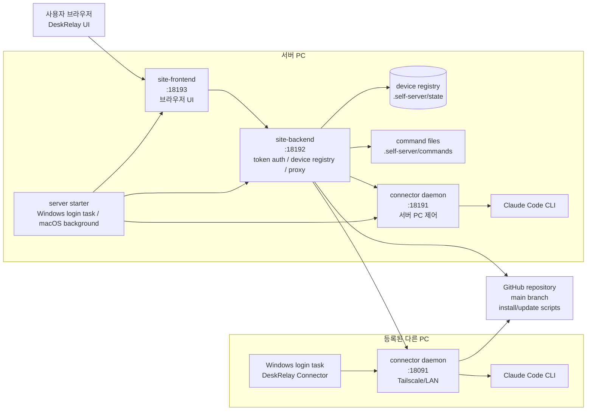
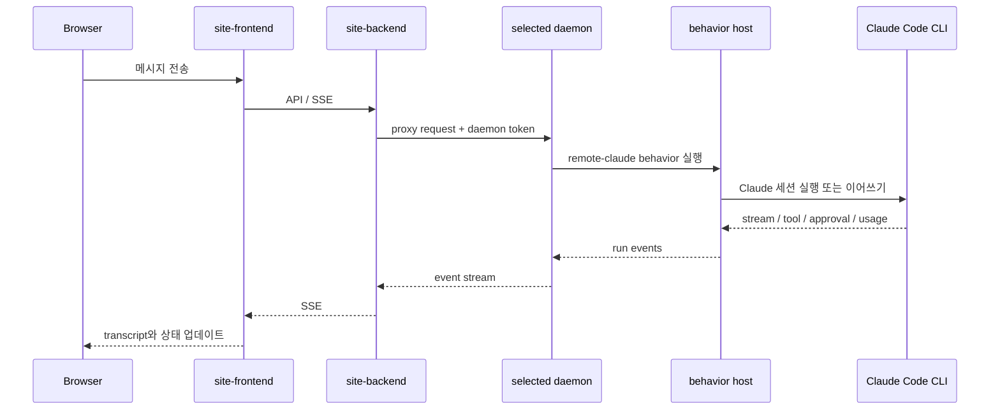

# DeskRelay

DeskRelay는 내 Windows PC에서 실행되는 Claude Code를 브라우저에서 제어하기 위한 self-host 개발 도구입니다. 외부 서비스에 맡기는 제품이 아니라, 사용자가 직접 자기 PC 한 대를 서버로 띄우고 같은 LAN 또는 Tailscale 안의 다른 PC를 등록해서 쓰는 구조입니다.

이 저장소는 **self-host DeskRelay**만 다룹니다. 서버, 브라우저 UI, connector daemon, 등록/삭제 스크립트가 모두 이 저장소 안에 있습니다.

## 누구에게 맞나

DeskRelay는 “설치 버튼 한 번으로 끝나는 앱”보다, 자기 개발 환경을 직접 이해하고 조정하는 파워유저에게 맞습니다.

- 여러 Windows PC에서 Claude Code를 쓰지만 매번 그 PC 앞에 앉고 싶지 않은 사람
- 브라우저에서 Claude Code 세션, 권한, 스킬, 지침, 작업 폴더를 한 화면으로 다루고 싶은 사람
- Tailscale 또는 LAN 안에서만 접근하도록 두고, 제어면을 공용 인터넷에 노출하고 싶지 않은 사람
- 문제가 생겼을 때 “오프라인” 한 단어가 아니라 서버, connector, daemon, 토큰, 포트, workspace root 중 어디가 막혔는지 보고 싶은 사람
- 완성된 상용 앱보다 git으로 가져와 수정하고 자기 워크플로에 맞게 바꿀 수 있는 도구를 선호하는 사람

## 핵심 개념

| 이름 | 의미 |
|---|---|
| 서버 PC | 브라우저 UI와 site backend를 띄우는 내 PC입니다. 기본 UI 포트는 `18193`입니다. |
| connector daemon | 각 PC에서 Claude Code, 파일, 세션, 권한, 스킬, 지침 API를 처리하는 로컬 daemon입니다. |
| Site token | 브라우저가 DeskRelay 서버에 들어갈 때 쓰는 토큰입니다. `.self-server` 아래에 저장됩니다. |
| daemon token | 서버가 각 connector daemon에 접근할 때 쓰는 디바이스별 토큰입니다. |
| workspace roots | 새 채팅 작업 폴더 탐색과 파일 접근을 허용할 루트 경로입니다. |
| current device | 현재 선택한 PC입니다. 세션, 권한, 스킬, 지침 로드는 이 디바이스에 종속됩니다. |
| current session | 현재 선택한 Claude 세션입니다. 작업 폴더 지침과 context 정보는 세션에 종속됩니다. |

## 빠른 시작

### 필요 조건

- Windows 서버: Windows PowerShell
- macOS 서버: Terminal
- Git/Bun은 PC에 없으면 서버 설치 명령이 자동 설치를 시도합니다.
- Claude Code CLI가 사용할 PC에 로그인되어 있어야 함
- 다른 PC를 제어하려면 같은 LAN 또는 같은 Tailscale tailnet

Tailscale은 외부 네트워크에서 내 PC에 접근하기 위한 권장 선택지입니다. connector 포트를 공용 인터넷에 직접 열지 마세요.

### 서버 PC 설치

#### Windows 서버

서버로 쓸 Windows PC의 PowerShell에 아래 명령을 그대로 붙여넣습니다. Git/Bun이 없으면 설치를 시도하고, `-WithTailscale`을 붙이면 Tailscale 설치와 로그인 상태 확인도 함께 진행합니다.

```powershell
$ErrorActionPreference = 'Stop'
$installer = Join-Path $env:TEMP 'deskrelay-install-server.ps1'
Invoke-WebRequest -UseBasicParsing -Uri 'https://raw.githubusercontent.com/darkhtk/deskrelay/main/scripts/install-server.ps1' -OutFile $installer
powershell -ExecutionPolicy Bypass -File $installer -WithTailscale
```

LAN 안에서만 쓸 거라면 마지막 줄의 `-WithTailscale`을 빼도 됩니다.

#### macOS 서버

macOS에서는 아래 명령을 Terminal에 붙여넣습니다. Git/Bun이 없으면 가능한 범위에서 설치를 시도하고, `--with-tailscale`을 붙이면 Tailscale 설치와 로그인 상태 확인도 함께 진행합니다.

```bash
curl -fsSL https://raw.githubusercontent.com/darkhtk/deskrelay/main/scripts/install-server-macos.sh -o /tmp/deskrelay-install-server-macos.sh
bash /tmp/deskrelay-install-server-macos.sh --with-tailscale
```

완료되면 기본 브라우저가 `http://127.0.0.1:18193`으로 열립니다.

Windows 서버 시작 시 생성되는 주요 파일:

- `.self-server\site-token.txt`
- `.self-server\commands\register-other-pc.txt`
- `.self-server\commands\remove-other-pc.txt`
- `.self-server\commands\update-server.txt`
- `DESKRELAY-SERVER-CODE.txt`
- `REGISTER-OTHER-PC.txt`
- `REMOVE-OTHER-PC.txt`
- `UPDATE-DESKRELAY-SERVER.txt`
- `REMOVE-DESKRELAY-SERVER.txt`

Windows 서버 PC에는 `DeskRelay Self Server` 로그인 작업이 자동 등록됩니다. 다음 로그인부터 site-backend, site-frontend, 서버 PC connector가 자동으로 올라옵니다. 이 옵션은 앱의 `설정 -> 일반`에서도 켜고 끌 수 있습니다.

macOS 서버 스크립트는 현재 백그라운드 프로세스로 서버를 띄우고 URL을 출력합니다. 자동 시작은 Windows 서버 경로가 더 안정적입니다.

### 접속 URL

서버 실행 후 상태 명령을 실행하면 현재 사용할 수 있는 URL이 나옵니다.

```powershell
Set-Location -LiteralPath (Join-Path $HOME 'deskrelay')
powershell -ExecutionPolicy Bypass -File .\scripts\self-pc-server-status.ps1
```

URL 종류:

- `http://127.0.0.1:18193`: 서버 PC 자신에서만 사용
- `http://100.x.x.x:18193`: Tailscale 주소, 같은 tailnet에서 사용
- `http://192.168.x.x:18193` 또는 `http://172.x.x.x:18193`: 같은 LAN에서 사용

다른 기기에서 열 때는 `DESKRELAY-SERVER-CODE.txt`의 `Recommended login URL for another device`를 우선 사용하세요. 이 URL에는 `#site-token=...`이 포함되어 있어서 처음 여는 브라우저도 토큰 입력 없이 들어갑니다.

## 다른 PC 등록

다른 PC 등록은 메인 화면의 설치/진단 wizard가 담당합니다.

1. 서버 PC에서 DeskRelay를 엽니다.
2. 메인 화면의 “다른 PC 등록 명령”을 통째로 드래그해서 복사합니다.
3. 제어하려는 다른 Windows PC의 PowerShell에 붙여넣습니다.
4. 스크립트가 GitHub에서 설치 파일을 내려받고, `$HOME\deskrelay`를 clone/update하고, connector daemon을 시작합니다.
5. 스크립트가 Tailscale/LAN IP를 감지하고 서버가 그 PC의 daemon에 접근 가능한지 검증합니다.
6. 검증이 통과하면 서버의 디바이스 목록에 등록됩니다.
7. 등록이 끝나면 Site token이 포함된 DeskRelay URL을 기본 브라우저로 엽니다.

등록 명령은 GitHub의 `scripts/install-connector.ps1`을 내려받아 실행합니다. 이 설치 스크립트가 다음을 처리합니다.

- Git/Bun 존재 확인
- 기존 `$HOME\deskrelay` 상태 판별
- 잘못된 repo 또는 dirty repo 백업 후 새 clone
- 오래된 connector login task 정리
- 점유된 `18091` 포트 정리 시도
- connector daemon을 `0.0.0.0:18091`에 바인딩
- Windows 방화벽 규칙 추가 시도
- Tailscale 또는 LAN 주소 감지
- 서버에서 대상 PC의 `/status` 접근 가능 여부 검증
- device row 등록
- 브라우저 열기

관리자 권한이 아니면 방화벽 규칙 자동 추가는 건너뛸 수 있습니다. 그래도 서버가 connector에 접근 가능한지 검증하므로, 막혀 있으면 방화벽 또는 네트워크 문제로 실패합니다.

## 디바이스 사용


브라우저에 들어가면 왼쪽 사이드바에서 디바이스를 선택합니다. 디바이스 선택은 브라우저에 저장되어 새로고침 후에도 유지됩니다.

주요 동작:

- `+`: 새 채팅 시작
- 검색 아이콘: 세션 검색 토글
- 세션 탭: 현재 디바이스의 Claude 세션 목록
- 권한 탭: 현재 디바이스와 현재 세션 작업 폴더의 권한 설정
- 지침 탭: 현재 세션 작업 폴더의 지침 파일
- 스킬 탭: 현재 디바이스와 현재 세션에서 사용할 수 있는 스킬과 슬래시 명령
- 설정 아이콘: 서버, 디바이스, 업데이트, 진단, 전역 지침, 도움말

새 채팅을 시작할 때는 작업 디렉토리를 고릅니다. 기본값은 현재 디바이스 기준으로 저장됩니다. 작업 폴더 탐색은 기본적으로 workspace roots 안에서만 동작하지만, 설정에서 제한 모드를 바꿀 수 있습니다.

## 채팅과 큐잉


컴포저에서 메시지를 연속으로 보내면 요청이 순서대로 큐잉됩니다. 앞 요청이 끝난 뒤 다음 요청이 같은 세션에 이어서 들어갑니다.

이미지 첨부도 컴포저에서 처리합니다. Claude CLI 자체가 이미지를 직접 띄우지 못해도 DeskRelay UI는 첨부 이미지와 생성된 이미지 파일을 브라우저에서 렌더링할 수 있습니다.

컴포저 위 상태줄은 “지금 입력 가능한가”를 중심으로 보여줍니다. 서버/connector/daemon 전체 상태 중 가장 중요한 내용은 상단 공지 영역에서, 현재 실행 중인 Claude 동작은 컴포저 근처에서 표시합니다.

## 권한, 스킬, 슬래시 명령


권한 탭은 현재 선택된 디바이스와 현재 선택된 세션 작업 폴더에 종속됩니다.

- User settings: 현재 디바이스 사용자 계정의 Claude 설정
- Project settings: 현재 세션 작업 폴더의 프로젝트 설정
- Project local settings: 현재 세션 작업 폴더의 로컬 설정
- 허용 목록 삭제
- `Bash(*)`, `Read(*)`, `Write(*)`, `Edit(*)`, `Grep(*)` 같은 권한 추가
- 다음 실행 권한 모드 선택

권한 모드는 사용자가 고른 값과 Claude가 실제로 보고한 값을 분리해서 다룹니다. 실행 시작 시 pending, 시스템 init 확인 후 confirmed, 불일치 시 mismatch로 표시합니다. 오래된 실행 응답이 사용자가 새로 고른 다음 권한 모드를 덮어쓰지 않도록 상태 모델을 분리했습니다.


스킬 탭은 현재 디바이스의 Claude 환경과 현재 세션 작업 폴더를 기준으로 로드됩니다. Claude 기본 스킬과 사용자가 추가한 스킬은 색으로 구분합니다. 슬래시 명령도 같은 탭에서 확인할 수 있습니다.

컴포저에서 `/`를 입력하면 가능한 슬래시 명령과 스킬 목록이 뜹니다. 키보드 위/아래 이동 시 스크롤 위치도 선택 항목을 따라갑니다.

## 지침 관리

DeskRelay의 지침 관리는 두 위치로 나뉩니다.

| 위치 | 대상 | 종속 기준 |
|---|---|---|
| 설정 -> 지침 | 사용자 전역 지침, 관리 정책 지침 | current device |
| 사이드바 -> 지침 | 프로젝트 지침, `.claude` 프로젝트 지침, 개인 로컬 지침 | current session의 cwd |

사용자 전역 지침은 선택한 디바이스의 `~/.claude/CLAUDE.md`입니다. 관리 정책 지침은 읽기 전용일 수 있고, 개인 self-host 설치에서는 비어 있을 수 있습니다.

작업 폴더 지침은 선택한 세션의 cwd에서 읽습니다.

- `cwd/CLAUDE.md`
- `cwd/.claude/CLAUDE.md`
- `cwd/CLAUDE.local.md`

사이드바 지침 뷰는 “Claude Code가 실제로 보는 지침 출처를 확인하는 것”을 우선합니다. 파일이 없으면 오류가 아니라 “파일 없음” 상태로 표시하고, 필요한 경우 생성해서 편집할 수 있습니다.

## 사용량과 context

상단에는 Claude `/usage` 기반의 Session, Week 사용량이 표시됩니다. 각 항목은 남은 비율과 reset 시간을 보여줍니다.

context 압축까지 남은 양은 현재 선택한 대화 세션 기준입니다. 대화를 선택하면 해당 세션 기준으로 즉시 갱신하고, 이후 주기적으로 갱신합니다.

표시 옵션은 `설정 -> 일반`에서 켜고 끌 수 있습니다.

- CTX 표시
- Session 표시
- Week 표시
- 채팅 글자 크기
- 세션 로드 개수
- 메시지 전송 후 아래로 이동
- 새 채팅 작업 폴더 탐색 제한

## 설정 범위

설정 화면에는 각 옵션의 적용 범위를 라벨로 표시합니다.

| 라벨 | 의미 |
|---|---|
| server | DeskRelay 서버 전체에 적용됩니다. Site token, device registry, 서버 업데이트, 서버 자동 시작이 여기에 속합니다. |
| current device | 현재 선택한 PC에 적용됩니다. connector, daemon URL, 기본 작업 폴더, CLI 전역 지침이 여기에 속합니다. |
| current session | 현재 선택한 Claude 세션과 그 작업 폴더에 적용됩니다. 세션 지침, 프로젝트 권한, context 정보가 여기에 속합니다. |
| browser | 지금 이 브라우저에만 적용됩니다. 테마, 글자 크기, 표시 옵션, 선택 기억이 여기에 속합니다. |


`설정 -> 일반`에는 업데이트와 브라우저 표시 옵션이 모여 있습니다.

- 전체 업데이트
- 서버 업데이트
- 디바이스별 connector 업데이트
- 현재 버전과 다음 버전 표시
- 자동 시작
- 테마
- 채팅 글자 크기
- 세션 로드 개수
- context/session/week 표시 옵션


`설정 -> 디바이스`는 이미 등록된 디바이스 관리만 담당합니다.

- 디바이스 선택
- 라벨 저장
- 기본 작업 디렉토리 저장
- 등록된 디바이스 제거
- 서버와 다른 모든 디바이스 제거

디바이스 제거는 가능하면 해당 PC의 `/system/uninstall`을 호출해 login task, connector state, behavior cache, logs, 설치 clone까지 함께 정리합니다. 오프라인이라 cleanup에 실패해도 서버 목록에서는 제거하고, 필요한 수동 cleanup 명령을 메인 화면에서 보여줍니다.


`설정 -> 연결 진단`은 선택한 디바이스가 실제로 사용 가능한 상태인지 확인합니다.

- 설치됨
- 로컬 실행
- 사이트 연결
- Claude 모듈
- Workspace
- 마지막 오류
- 서버/connector 버전 일치 여부

## 업데이트

DeskRelay는 git 저장소를 기준으로 업데이트합니다.

권장 순서:

1. `설정 -> 일반 -> 전체 업데이트`
2. 등록된 connector들을 먼저 업데이트
3. 서버 PC git checkout 업데이트
4. 서버 재시작
5. 브라우저 새로고침

꺼져 있는 디바이스는 즉시 업데이트할 수 없습니다. 켜진 뒤 전체 업데이트를 다시 실행하거나, 해당 PC에서 등록 명령을 다시 실행하세요.

터미널에서 서버만 업데이트하려면:

```powershell
Set-Location -LiteralPath (Join-Path $HOME 'deskrelay')
powershell -ExecutionPolicy Bypass -File .\scripts\self-pc-server-update.ps1
```

## 서버 중지와 제거

서버 중지:

```powershell
Set-Location -LiteralPath (Join-Path $HOME 'deskrelay')
powershell -ExecutionPolicy Bypass -File .\scripts\self-pc-server-stop.ps1
```

서버 상태 제거:

```powershell
Set-Location -LiteralPath (Join-Path $HOME 'deskrelay')
powershell -ExecutionPolicy Bypass -File .\scripts\self-pc-server-uninstall.ps1
```

이 명령은 서버가 켜져 있으면 등록된 디바이스에 먼저 uninstall 요청을 보내고, 그 다음 서버 PC의 `.self-server` 런타임 상태와 생성된 quick command 파일을 제거합니다. git clone 폴더는 기본적으로 남깁니다. 폴더까지 지우려면 `-RemoveRepo`를 붙입니다.

## 문제 해결

### 스크립트를 실행할 수 없다는 메시지

PowerShell 실행 정책 때문에 `.ps1` 실행이 막히면 다음처럼 실행합니다.

```powershell
powershell -ExecutionPolicy Bypass -File .\scripts\self-pc-server-start.ps1
```

### 디바이스가 목록에 안 뜸

확인할 것:

- 등록 명령에 서버 URL과 Site token이 포함되어 있는가
- 서버 URL이 `127.0.0.1`이 아닌 Tailscale 또는 LAN URL인가
- 대상 PC가 같은 Tailscale tailnet 또는 같은 LAN 안에 있는가
- 대상 PC의 `18091` 포트가 서버 PC에서 열리는가
- 방화벽이 inbound TCP `18091`을 막고 있지 않은가
- 기존 connector가 포트를 점유하고 있지 않은가

대상 PC에서 확인:

```powershell
Get-NetTCPConnection -LocalPort 18091 -State Listen
```

서버 PC에서 확인:

```powershell
Invoke-RestMethod http://<target-pc-ip>:18091/status -Headers @{ Authorization = "Bearer <daemon-token>" }
```

daemon token은 대상 PC에서 다음으로 확인합니다.

```powershell
Set-Location -LiteralPath (Join-Path $HOME 'deskrelay')
bun run packages/pc-connector-daemon/src/bin.ts auth-token
```

### `forbidden: ... outside the configured workspace roots`

현재 선택한 디바이스의 workspace roots 밖을 열려고 한 것입니다.

해결:

- 서버 또는 대상 PC에서 `CR_CONNECTOR_WORKSPACE_ROOTS`를 원하는 루트로 설정
- 서버/connector 재시작
- 또는 설정에서 새 채팅 작업 폴더 탐색 제한을 조정

예:

```powershell
$env:CR_CONNECTOR_WORKSPACE_ROOTS = "C:\sourcetree"
powershell -ExecutionPolicy Bypass -File .\scripts\self-pc-server-stop.ps1
powershell -ExecutionPolicy Bypass -File .\scripts\self-pc-server-start.ps1
```

다른 PC connector는 해당 PC에서 등록 명령을 다시 실행하는 편이 가장 확실합니다.

### 서버 포트가 이미 사용 중

기본 포트:

- `18191`: 서버 PC connector daemon
- `18192`: site-backend
- `18193`: site-frontend

확인:

```powershell
Get-NetTCPConnection -LocalPort 18191,18192,18193 -State Listen |
  Select-Object LocalPort, OwningProcess
```

필요하면 해당 프로세스를 종료합니다.

```powershell
taskkill /PID <OwningProcess> /T /F
```

### 토큰 입력을 계속 요구함

다른 기기에서 접속할 때는 `#site-token=...`이 포함된 URL을 사용하세요.

`DESKRELAY-SERVER-CODE.txt`에서 확인:

```text
Recommended login URL for another device:
http://...:18193/#site-token=...
```

브라우저가 이미 잘못된 토큰을 저장했다면 로그아웃 후 이 URL로 다시 들어갑니다.

## 구조

DeskRelay self 서버를 켜면 서버 PC 안에서 세 개의 로컬 프로세스가 함께 뜹니다.

- `daemon`: 서버 PC 자체를 제어 가능한 디바이스로 노출합니다. 기본 포트는 `18191`입니다.
- `site-backend`: Site token 인증, 디바이스 레지스트리, proxy, 등록/삭제 명령 생성을 맡습니다. 기본 포트는 `18192`입니다.
- `site-frontend`: 브라우저가 여는 DeskRelay UI입니다. 기본 포트는 `18193`입니다.



## 요청 흐름



## 개발과 검증

설치:

```powershell
bun install
```

자주 쓰는 검증:

```powershell
bun run test:selfhost-docs
bun --filter @deskrelay/site-frontend typecheck
bun --filter @deskrelay/site-frontend test
bun --filter @deskrelay/site-frontend build
```

전체 검증:

```powershell
bun run check
bun run typecheck
bun run test
bun run build
```

self-host 가상 테스트:

```powershell
bun run test:selfhost-failures
bun run test:selfhost-virtual
```

로컬 self 서버 시작:

```powershell
powershell -ExecutionPolicy Bypass -File .\scripts\self-pc-server-start.ps1
```

로컬 self 서버 중지:

```powershell
powershell -ExecutionPolicy Bypass -File .\scripts\self-pc-server-stop.ps1
```

## 라이선스

Apache-2.0. 자세한 내용은 [LICENSE](LICENSE)를 확인하세요.
