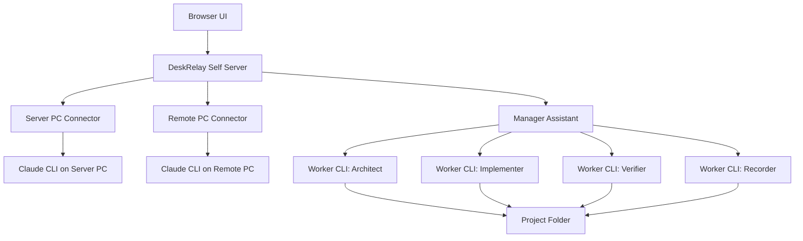

# DeskRelay Self-host AI Workbench Plan

Canonical foundation: [PRODUCT_FOUNDATION.md](PRODUCT_FOUNDATION.md)

## Purpose

DeskRelay is not just a remote Claude CLI client. Its larger goal is to become a self-hosted AI development workbench where a power user can control their own PCs, CLI tools, and multiple AI workers from one browser interface.

The product is built for local ownership rather than SaaS release. The user owns the server, the devices, the project folders, the worker sessions, and the records of what happened.

## Product Thesis

DeskRelay should become a browser-based control room for local AI development work.

The user gives intent. The manager assistant interprets that intent, chooses the right API or worker path, supervises execution, verifies results, records failures, and improves the operating protocol over time.

The game, app, or code being built is often a test target. The more important artifact is the reliable multi-agent workflow that can keep improving itself without losing control, context, or trust.

## Target Users

- Power users who already use Claude Code or Claude CLI heavily.
- Developers who want to access their own PCs from another browser or mobile device.
- Users who prefer Git, local files, self-hosting, and direct control over cloud SaaS.
- Builders experimenting with multi-agent development workflows.
- Users who want AI workers to be supervised, not just launched.

## Core Values

- The user's PC is the center.
- Local state must be visible and recoverable.
- A device marked online must also be operationally reachable.
- Every worker should have a role, a stable session, a task history, and an outcome.
- The manager assistant must supervise and verify; it should not silently become the only worker.
- Failed work must be classified, not buried.
- UI should show only information the user can act on.

## System Structure

## Product Surfaces

### Main Screen

The main screen should be the installation and recovery entry point.

It should identify whether the current browser is on:

- the server PC,
- a registered device,
- an unregistered desktop device,
- or a mobile/browser-only client.

It should provide copyable commands for server install, server removal, other PC registration, other PC removal, and update repair.

### Chat Workspace

The chat workspace should remain stable and familiar.

It should support:

- selected device persistence,
- selected session persistence,
- session list grouping by project,
- current device permissions,
- skills and slash command discovery,
- instruction visibility and editing,
- image preview and attachments,
- export to Markdown or PDF,
- cached conversation reads where appropriate.

### Manager Assistant

The manager assistant should behave like a normal Claude CLI conversation, with extra authority and API access.

It should be able to:

- inspect DeskRelay state,
- diagnose devices,
- run manager APIs,
- launch or resume worker CLIs,
- read worker responses,
- classify failures,
- update orchestration files,
- and report progress.

It must not create unnecessary sessions every round. Worker identity should be stable by role, profile, cwd, and session id.

### Orchestration Workspace

The orchestration workspace should show the state of a multi-agent project.

It should show:

- objective,
- active round,
- agents,
- running tasks,
- blocked tasks,
- latest outputs,
- failure categories,
- artifacts,
- and a compact visual graph.

The graph should emphasize the current state rather than every historical message.

## Manager Assistant Operating Model

The manager assistant has three responsibilities.

1. Interpret the user's goal.
2. Choose an execution path.
3. Supervise and verify the result.

It should use APIs first when the API is reliable. It should use worker CLIs when development or investigation is required. It should ask the user only when a decision changes scope, risk, data, or destructive behavior.

The manager should not do all implementation itself if the task is explicitly about orchestration. It should create or reuse workers, inspect their results, update the protocol, and keep the project moving.

## Worker Model

Workers should be treated as durable role sessions, not disposable one-shot calls.

Each worker should have:

- role,
- label,
- profile,
- cwd,
- session id,
- current task,
- last output,
- last error,
- status,
- and updated time.

Recommended roles:

- architect,
- implementer,
- verifier,
- recorder,
- critic,
- protocol maintainer.

## UX Principles

- Keep the chat UI calm.
- Put operational complexity in settings, the main screen, or the orchestration workspace.
- Avoid nested panels and unnecessary visual depth.
- Show action buttons only when the user can use them.
- Label setting scope as server, current device, current session, or browser.
- Prefer status messages over conversational filler.
- Do not expose backend trivia that gives the user no useful action.

## Success Criteria

DeskRelay is successful when:

- another Windows PC can be registered from one copy-paste command,
- registration failure reports the exact failed step,
- server and connector update status is visible,
- manager assistant conversations survive refresh and redeploy,
- worker sessions are reused across rounds,
- orchestration state is visible without reading raw logs,
- users can tell who is doing what,
- failed work creates structured records,
- and a new project can be driven through multiple AI workers without losing the protocol.

## Implementation Plan

### Phase 1: Trustworthy Install And Connection

Goal: make installation, registration, update, and removal boring.

Work items:

- Make the install wizard classify the current machine as server, registered device, unregistered device, or browser-only client.
- Strengthen the other-PC installer so it handles Git, Bun, Tailscale detection, firewall checks, stale connector cleanup, and browser opening.
- If the browser already has an active DeskRelay tab, refresh that tab through the server event API instead of opening another tab.
- Add structured installer reports for every step: detected, fixed, skipped, failed, and next action.
- Collapse repeated installer failures from the same PC and failing step, and provide report cleanup.
- Keep server URL, Site token, and registration command in one generated source of truth.
- Ensure device removal also explains what remains on the target PC and how to uninstall it.

Tests:

- fresh Windows server install,
- server reinstall over existing folder,
- other PC registration with stale connector,
- other PC registration without elevated PowerShell,
- other PC registration without Tailscale,
- removal of remote connector,
- server removal and restart from scratch.

### Phase 2: Connection State And Recovery

Goal: make "online" mean something operationally useful.

Work items:

- Separate registry presence, heartbeat, local daemon health, server reachability, Claude CLI readiness, and workspace access.
- In connection diagnostics, show status, meaning, and next action for each row.
- Keep detailed backend-only causes out of the UI unless the user can act on them.
- Add device-level update status: unknown, checking, current, update available, updating, restart pending, failed.
- Make update buttons enabled only when the current state allows them.

Tests:

- daemon killed,
- daemon port occupied,
- remote Tailscale unreachable,
- server can list device but cannot reach daemon,
- old connector version,
- update succeeds,
- update fails and reports retry path.

### Phase 3: Stable Chat And Session Handling

Goal: make chat feel like a normal persistent CLI surface.

Work items:

- Persist selected device and selected session per browser.
- Cache recently loaded session, week, and context usage with explicit TTL.
- Cache conversation reads and images locally when enabled.
- Make queue state visible without appending tool chatter as chat messages.
- Keep result metadata useful: status, 24-hour time, duration, turns.
- Avoid duplicate session rows by session id.
- Keep worker sessions stable across orchestration rounds.

Tests:

- refresh after selecting a device,
- refresh after selecting a session,
- switch network on mobile,
- open same server from another browser,
- send multiple queued messages,
- worker round 1 and round 2 reuse the same session id.

### Phase 4: Manager Assistant As Supervisor

Goal: make the manager assistant a reliable operator, not a second awkward chat.

Work items:

- Store manager conversation like normal chat.
- Give manager a stable CLI session.
- Keep manager instructions focused on intent clarification, API use, worker delegation, verification, and status reporting.
- Add role-based operating instructions for supervisor, developer, verifier, and maintenance tasks.
- Add a status line that shows what the manager is doing.
- Add preset action buttons, starting with Orchestration.

Tests:

- ask status,
- ask for diagnosis,
- ask for update,
- ask to start orchestration,
- manager launches multiple workers,
- manager resumes existing workers,
- manager reports progress without being prompted.

### Phase 5: Orchestration Workspace

Goal: show multi-agent work without forcing the user to read logs.

Work items:

- Split the main work area into Chat and Orchestration tabs.
- Keep the assistant available in the orchestration tab.
- Add task board summary: active, running, blocked, done.
- Add agent table with role, status, session, last output time.
- Add compact graph view for current round and dependency shape.
- Replace noisy sequence diagrams with a state-oriented graph.
- Cache orchestration state in the browser and update from backend events.

Tests:

- no project selected,
- project selected with no rounds,
- active round with multiple workers,
- stale running workers,
- blocked task,
- completed round,
- browser refresh during active orchestration.

### Phase 6: Protocol And Artifact Management

Goal: make the orchestration framework itself improve over time.

Work items:

- Define canonical files for orchestration projects.
- Add manager APIs for reading and summarizing project artifacts.
- Add failure taxonomy and retirement rules for outdated notes.
- Add session hygiene: archive, collapse, or hide noisy worker sessions.
- Add audit trail for manager decisions and worker outputs.

Recommended files:

- ORCHESTRATION.md
- AGENTS.md
- PROTOCOL.md
- TASKS.md
- STATE.md
- FAILURES.md
- ARTIFACTS.md
- PROJECT.md

Tests:

- create new orchestration project,
- continue existing project,
- worker writes artifact,
- verifier rejects artifact,
- manager updates protocol,
- stale task is retired.

## Immediate Next Steps

1. Finish offline-device update durability: persist desired connector update state and retry when the device becomes reachable.
2. Add Tailscale and Windows Firewall status as separate backend diagnosis steps, but show only failed or actionable rows in the UI.
3. Add virtual UI regression coverage for browser refresh, orchestration event replay, slash command scrolling, attachments, and cached mobile reload.
4. Harden stale connector cleanup so the installer can classify "port occupied by old DeskRelay" separately from "port occupied by unknown process".
5. Keep refining the orchestration workspace toward current-state vertical graphs and stable worker-session evidence.

## Non-Goals For Now

- Public SaaS release.
- Microsoft Store packaging.
- Cloud billing.
- Multi-tenant account management.
- Fully autonomous destructive actions without confirmation.
- Making the chat UI visually experimental at the cost of stability.
