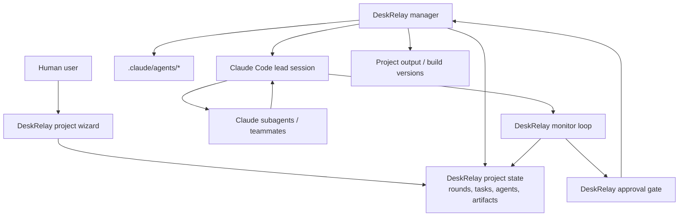

# Claude Agents / Subagents Orchestration Analysis

Reviewed: 2026-05-18  
Scope: DeskRelay orchestration project management and manager/workboard UX.

## Summary

Claude Code의 새 agents/subagents 기능은 DeskRelay가 만들고 있는 오케스트레이션 기능에 잘 맞는 실행 백엔드가 될 수 있다. 다만 DeskRelay의 역할을 대체하기보다는, DeskRelay가 프로젝트 상태와 승인 게이트를 관리하고 Claude agents를 작업 실행자로 붙이는 구조가 더 안전하다.

Recommended direction:

- Keep DeskRelay as the orchestration source of truth.
- Generate and manage project-scoped Claude agent definitions in `.claude/agents/`.
- Use Claude subagents for focused research, implementation slices, and verification.
- Use Claude Agent Teams only for large work that benefits from teammate communication.
- Keep DeskRelay responsible for state machine, approval gates, transcript ingestion, project artifacts, and user-visible progress.

## Feature Snapshot

| Feature | What It Gives Us | Fit |
|---|---|---|
| Project subagents | Reusable role definitions stored in `.claude/agents/` | Strong fit for planner/implementer/verifier/reviewer roles |
| SDK subagents | Programmatic agent definitions and explicit invocation | Strong fit for DeskRelay-managed dispatch |
| Forked subagents | Background task that inherits parent context | Useful for side tasks that need full context, but experimental |
| Agent Teams | Multiple Claude Code sessions with shared tasks and messaging | Closest to true multi-agent orchestration, but experimental |
| Hooks | Event-triggered checks and quality gates | Useful for verification and policy enforcement |

## What Subagents Solve Well

Subagents are useful when the work is focused and the parent only needs the result:

- Read many files and return a compact summary.
- Review a module from a clean perspective.
- Run a verification pass without polluting the main manager context.
- Split independent implementation tasks by file/module ownership.
- Keep specialized instructions out of the main prompt.
- Version project-specific roles with the repo.

This maps well to DeskRelay roles:

| DeskRelay Role | Claude Subagent Type |
|---|---|
| Planner | `planner` or `architect` agent |
| Implementer | `implementer` agent with write tools |
| Verifier | `verifier` agent with read/test tools |
| Critic | `reviewer` or `critic` agent |
| Protocol | `protocol-auditor` agent |
| Documenter | `documenter` agent |

## What Subagents Do Not Solve

Subagents are not a full orchestration layer by themselves.

Important constraints:

- A subagent starts with fresh context unless using fork mode.
- The only reliable context channel is the prompt or filesystem state.
- Subagents report back to the main agent; they do not coordinate peer-to-peer.
- Subagents cannot spawn other subagents.
- Background permission prompts may block or auto-deny risky operations.
- Long prompts can be awkward on Windows, so filesystem-based agent definitions are preferable.
- The parent still needs to decide what to do with the result.

For DeskRelay, this means subagents are good workers, but not the project manager.

## Agent Teams Fit

Claude Agent Teams are closer to what DeskRelay calls orchestration:

- A lead coordinates teammates.
- Teammates run as independent Claude Code sessions.
- A shared task list exists.
- Teammates can message each other.
- The user can interact with individual teammates.

This is a better fit for large projects such as a Godot game, cross-layer frontend/backend work, or parallel code review.

Current concerns:

- Agent Teams are experimental.
- Task status can lag.
- In-process teammates do not resume cleanly across sessions.
- Only one team can be managed by a lead at a time.
- No nested teams.
- Split-pane mode depends on tmux or iTerm2 and is not a Windows-first UX.
- Token use is much higher than ordinary subagents.

Conclusion: Agent Teams should be an optional execution mode, not the default DeskRelay foundation yet.

## Recommended Architecture



DeskRelay should remain the durable state layer. Claude agents should be treated as execution workers whose conversations, outputs, and decisions are ingested into DeskRelay.

## Project Creation UX

When creating a project, the wizard should ask:

1. Use DeskRelay base protocol?
2. Create Claude agent definitions for this project?
3. Choose execution mode:
   - DeskRelay workers
   - Claude subagents
   - Claude Agent Team experiment
4. Choose role set:
   - Minimal: planner, implementer, verifier
   - Full: planner, architect, implementer, verifier, critic, documenter
   - Custom
5. Choose permission posture:
   - Read-only planning first
   - Write allowed after approval
   - Fully autonomous within project boundary

The wizard output should be a project charter plus generated `.claude/agents/*.md` files.

## DeskRelay State Mapping

| DeskRelay Field | Claude Source |
|---|---|
| Agent name | Claude subagent name or team teammate name |
| Agent status | Running tab, transcript event, task state, or DeskRelay observation |
| Current task | DeskRelay task packet sent to Claude |
| Last output | Final message or streamed result summary |
| Evidence | Files changed, tests run, logs, transcript references |
| Approval needed | Proposed action or permission boundary crossing |
| Build version | Artifact generated by the orchestrated project |

## Dispatch Packet

Each Claude agent invocation should receive a compact packet, not the whole DeskRelay history.

Suggested shape:

```json
{
  "project": {
    "id": "project_...",
    "name": "Godot 2D Korean ARPG",
    "cwd": "C:\\projects\\game",
    "goal": "Create a playable vertical slice"
  },
  "role": "verifier",
  "task": {
    "id": "task_...",
    "objective": "Verify combat loop and Korean UI",
    "ownedPaths": ["game/scripts", "game/scenes"],
    "constraints": ["Do not modify assets outside game/assets"]
  },
  "protocol": {
    "phase": "verification",
    "mustReturn": ["summary", "changedFiles", "tests", "risks", "nextAction"]
  }
}
```

The agent should return structured output:

```json
{
  "summary": "What was done",
  "changedFiles": [],
  "tests": [],
  "risks": [],
  "needsUserApproval": false,
  "nextAction": "Recommended next step"
}
```

## UI Implications

The Work tab should not expose all Claude internals by default. It should show:

- Agent name
- Status
- Current action
- Approval needs
- Last meaningful output
- Evidence and artifacts on expansion

Detailed transcript, raw JSON, tool calls, and logs should be available but folded away.

This matches the current direction for the agent status panel: collapsed rows by default, expandable details, and readable rendering for structured output.

## Implementation Plan

### Phase 1. Agent Definition Generator

Add project-level support for generating `.claude/agents/` files.

Deliverables:

- Agent role templates.
- API to preview generated definitions.
- API to write/update `.claude/agents/*.md`.
- Wizard option to create agent set during project creation.

### Phase 2. Claude Subagent Execution Mode

Allow a DeskRelay task to target a Claude subagent.

Deliverables:

- Execution target field: `deskrelay-worker`, `claude-subagent`, `claude-team`.
- Dispatch packet builder.
- Result parser for structured JSON/Markdown.
- Transcript reference storage.

### Phase 3. Monitoring and State Ingestion

Bring Claude progress back into DeskRelay.

Deliverables:

- Poll or ingest Claude transcript files when available.
- Normalize Claude statuses into DeskRelay agent statuses.
- Detect stale actions and stuck agents.
- Convert agent outputs into evidence and proposed actions.

### Phase 4. Approval Gate Integration

DeskRelay approval remains authoritative.

Deliverables:

- Preflight check before approving a Claude-generated action.
- Stale approval cleanup.
- Clear distinction between "start next round", "accept result", and "approve risky action".
- User-facing reason for every approval request.

### Phase 5. Agent Teams Experiment

Expose Agent Teams as an advanced option.

Deliverables:

- Team mode flag per project.
- Team role presets.
- Team status panel.
- Manual cleanup and recovery controls.
- Warning that Agent Teams are experimental and token-heavy.

## Decision Matrix

| Situation | Recommended Mode |
|---|---|
| Quick codebase research | Claude subagent |
| Independent verifier/reviewer pass | Claude subagent |
| Single-file or tightly coupled fix | Main Claude/DeskRelay worker |
| Cross-layer feature with clear ownership | Agent Team or multiple DeskRelay workers |
| Agents need to debate or message each other | Agent Team |
| User needs auditable approvals | DeskRelay approval gate |
| Long-running product orchestration | DeskRelay as manager, Claude agents as workers |

## Risks And Mitigations

| Risk | Mitigation |
|---|---|
| Agent output is too raw | Render Markdown and JSON into readable fields |
| Agent status disagrees with DeskRelay | DeskRelay state machine owns the final status |
| Claude task is done but approval remains | Preflight validation and stale action cleanup |
| Agent edits conflict | Assign owned paths per worker |
| Token use grows too much | Use subagents for focused tasks; reserve Agent Teams for high-value parallel work |
| Claude feature behavior changes | Keep Claude integration behind an execution-mode adapter |
| Windows prompt length issues | Prefer filesystem-based `.claude/agents/` definitions |

## Source Links

- [Claude Code subagents documentation](https://code.claude.com/docs/en/sub-agents)
- [Claude Agent SDK subagents documentation](https://code.claude.com/docs/en/agent-sdk/subagents)
- [Claude Code Agent Teams documentation](https://code.claude.com/docs/en/agent-teams)
- [Claude Code features overview](https://code.claude.com/docs/en/features-overview)
- [Anthropic blog: How and when to use subagents in Claude Code](https://claude.com/blog/subagents-in-claude-code)
