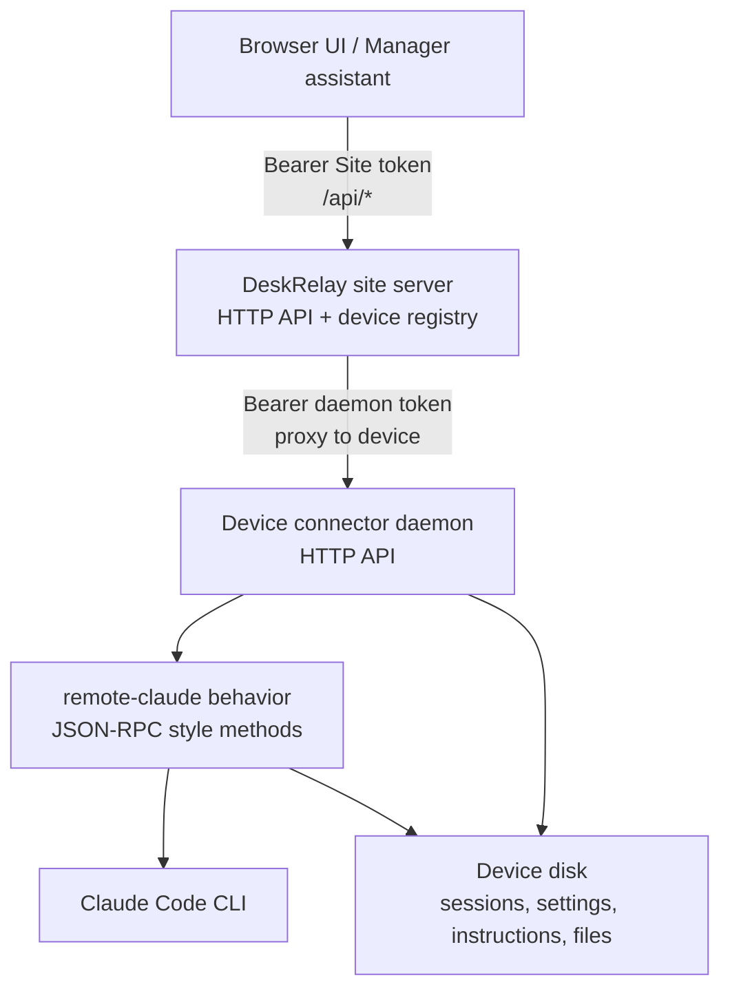

# DeskRelay Manager Assistant API Surface

This document lists the APIs available to a DeskRelay management assistant. The assistant is allowed to automate DeskRelay and Claude Code because automation is the product goal.

## Topology



## Authentication

| Surface | Auth | Notes |
|---|---|---|
| Site `GET /healthz` | none | Public liveness and version check. |
| Site `/api/*` | `Authorization: Bearer <site token>` | `/api/announcement` is intentionally readable without token. |
| Vite local helper `/__deskrelay/*` | local client only | Only served by the frontend dev server; used to auto-enter from the server PC. |
| Daemon `/pairing/status` | none, local-origin CORS gated | Minimal public pairing state. |
| Daemon all other routes | `Authorization: Bearer <daemon token>` | Token lives on the device, not in browser storage. The site stores it per registered device and proxies calls. |
| Behavior methods | daemon auth first | Called via `POST /behaviors/:instanceId/request` or site proxy equivalent. |

## Site HTTP API

Base URL for the browser/self-host page is usually the frontend URL, for example `http://127.0.0.1:18193` or a Tailscale URL. The frontend proxies `/api` and `/healthz` to the site backend.

| Method | Path | Purpose | Input |
|---|---|---|---|
| `GET` | `/healthz` | Site health, version, build info, registered device count. | none |
| `GET` | `/api/capabilities` | Server API capabilities, feature list, and assistant-visible routes. | none |
| `GET` | `/api/announcement` | Current version/update notice payload. | none |
| `GET` | `/api/devices` | List registered devices. | none |
| `POST` | `/api/devices` | Register or replace a device after probing its daemon. | JSON `{ daemonUrl, label?, authToken?, deviceKey? }` |
| `PATCH` | `/api/devices/:id` | Rename device. | JSON `{ label }` |
| `DELETE` | `/api/devices/:id` | Remove one device and request connector cleanup. | none |
| `DELETE` | `/api/devices` | Remove server and all registered devices. | none |
| `GET` | `/api/devices/update-queue` | Read queued/offline device update states. | none |
| `GET` | `/api/self/register-other-pc-command` | Build a copy-paste command for registering another PC. | none |
| `GET` | `/api/self/remove-other-pc-command` | Build a copy-paste command for removing another PC connector. | none |
| `GET` | `/api/self/doctor` | Server-side diagnostic report. | none |
| `GET` | `/api/self/logs` | Read server stack logs. | query `source=server|frontend|daemon`, `tail`, optional `level` |
| `GET` | `/api/self/process/status` | Read server process status and recorded stack components. | none |
| `POST` | `/api/self/process/restart` | Request server stack restart when wired. | none |
| `GET` | `/api/self/network/status` | Server network summary: local/LAN/Tailscale URLs and preferred remote URL. | none |
| `GET` | `/api/self/install/status` | Server install/running/autostart/update/report summary. | none |
| `GET` | `/api/self/security/boundary` | Server token and network exposure summary without exposing secrets. | none |
| `GET` | `/api/self/autostart` | Server login-task/autostart status. | none |
| `PUT` | `/api/self/autostart` | Enable/disable server autostart. | JSON `{ enabled: boolean }` |
| `POST` | `/api/self/update` | Start self-server update. | none |
| `GET` | `/api/self/update/status` | Read self-server update state. | none |
| `GET` | `/api/self/install-reports` | Recent install/register reports. | query `limit`, currently frontend uses `5` |
| `POST` | `/api/self/install-reports` | Store an install/register report. | arbitrary JSON report |

## Site-To-Daemon Proxy API

These routes resolve `:id` through the site device registry, attach the device daemon token, then call the daemon.

| Method | Path | Proxies To | Purpose |
|---|---|---|---|
| `GET` | `/api/devices/:id/capabilities` | `GET /capabilities` | Read device API capabilities. |
| `GET` | `/api/devices/:id/logs` | `GET /logs` | Read connector logs. |
| `GET` | `/api/devices/:id/process/status` | `GET /process/status` | Read connector process status. |
| `POST` | `/api/devices/:id/process/restart` | `POST /process/restart` | Request connector restart. |
| `GET` | `/api/devices/:id/network/status` | `GET /network/status` | Read connector network/Tailscale/bind status, enriched with registry URL. |
| `GET` | `/api/devices/:id/install/status` | `GET /install/status` | Read connector install/running/autostart/update queue summary. |
| `GET` | `/api/devices/:id/security/boundary` | `GET /security/boundary` | Read connector token/network/workspace boundary summary without exposing secrets. |
| `GET` | `/api/devices/:id/behaviors` | `GET /behaviors` | List loaded behaviors. |
| `POST` | `/api/devices/:id/behaviors/load` | `POST /behaviors/load` | Load a behavior package. |
| `DELETE` | `/api/devices/:id/behaviors/:instance` | `DELETE /behaviors/:instance` | Unload behavior. |
| `POST` | `/api/devices/:id/behaviors/:instance/request` | `POST /behaviors/:instance/request` | Call a behavior method. |
| `GET` | `/api/devices/:id/events/spaces/:spaceId/stream` | `GET /events/spaces/:spaceId/stream` | SSE stream for run events; supports `Last-Event-ID`. |
| `GET` | `/api/devices/:id/fs/list` | `GET /fs/list` | Browse directories. Query: `path`, optional `workspaceScope=unrestricted`. |
| `POST` | `/api/devices/:id/fs/mkdir` | `POST /fs/mkdir` | Create a directory. |
| `GET` | `/api/devices/:id/fs/roots` | `GET /fs/roots` | Read workspace root policy. |
| `GET` | `/api/devices/:id/files/preview` | `GET /files/preview` | Preview guarded local image/blob. Query: `path`, optional `cwd`. |
| `GET` | `/api/devices/:id/git/status` | `GET /git/status` | Git status for a cwd. Query: `cwd`. |
| `GET` | `/api/devices/:id/instructions` | `GET /instructions` | Read Claude instruction files. Query: `cwd`. |
| `PUT` | `/api/devices/:id/instructions/:scope` | `PUT /instructions/:scope` | Write one instruction file. |
| `DELETE` | `/api/devices/:id/instructions/:scope` | `DELETE /instructions/:scope` | Delete one editable instruction file. |
| `GET` | `/api/devices/:id/diagnostics` | `GET /status` | Raw daemon status used by settings. |
| `GET` | `/api/devices/:id/doctor` | composed probes | Device diagnostic report. |
| `POST` | `/api/devices/:id/system/update` | `POST /system/update` | Update the connector on that device; queues fallback if offline. |
| `POST` | `/api/devices/:id/approvals/respond` | `POST /hooks/pretooluse/respond` | Resolve a pending Claude Code tool approval. |
| `POST` | `/api/devices/:id/approvals/simulate` | `POST /hooks/pretooluse/simulate` | Test approval UI without Claude hook traffic. |

## Daemon HTTP API

The connector daemon defaults to `http://127.0.0.1:18091` on local-only runs and `0.0.0.0:18091` for registered self-host devices. Except for `/pairing/status`, every route requires the daemon bearer token.

| Method | Path | Purpose | Input |
|---|---|---|---|
| `GET` | `/pairing/status` | Public minimal pairing state for local browser detection. | none |
| `GET` | `/capabilities` | Daemon API capabilities, feature list, routes, and behavior method names. | none |
| `GET` | `/logs` | Read connector log tail. | query `source=connector|daemon`, `tail`, optional `level` |
| `GET` | `/process/status` | Read connector daemon process status, build, listening address, and login task state. | none |
| `POST` | `/process/restart` | Request connector restart through the login task when wired. | none |
| `GET` | `/network/status` | Connector network summary: addresses, Tailscale detection, listener bind, local probe. | none |
| `GET` | `/install/status` | Connector install/running/login-task summary. | none |
| `GET` | `/security/boundary` | Connector token, network, and workspace boundary summary. | none |
| `GET` | `/status` | Service health, build, listening address, workspace roots, loaded behaviors, broker stats, pairing state, diagnostic flags. | none |
| `GET` | `/behaviors` | Loaded behavior summaries. | none |
| `POST` | `/behaviors/load` | Load behavior package. | JSON `{ packageDir, instanceId? }` |
| `DELETE` | `/behaviors/:instanceId` | Unload behavior. | none |
| `POST` | `/behaviors/:instanceId/request` | Call behavior RPC method. | JSON `{ method, params?, timeoutMs? }` |
| `GET` | `/events/spaces/:spaceId/stream` | SSE event stream. | Header `Last-Event-ID` or query `lastEventId` |
| `GET` | `/fs/list` | Directory listing under workspace policy. | query `path`, optional `workspaceScope=unrestricted` |
| `GET` | `/fs/roots` | Current workspace root mode and roots. | none |
| `POST` | `/fs/mkdir` | Create directory. | JSON `{ parent, name, workspaceScope? }` |
| `GET` | `/files/preview` | Return guarded binary preview. | query `path`, optional `cwd` |
| `GET` | `/git/status` | Git status. | query `cwd` |
| `GET` | `/instructions` | Read Claude instruction files. | query `cwd` |
| `PUT` | `/instructions/:scope` | Write instruction content. | JSON `{ content, cwd?, expectedHash? }` |
| `DELETE` | `/instructions/:scope` | Delete instruction file. | JSON `{ cwd?, expectedHash? }` |
| `POST` | `/pairing/reload` | Reload site relay identity after legacy pairing. | none |
| `POST` | `/system/uninstall` | Remove local connector state/login task; optional repo removal. | JSON `{ removeRepo?: boolean }` |
| `POST` | `/system/update` | Update local source checkout and restart through login task when wired. | none |
| `POST` | `/hooks/pretooluse` | Claude Code PreToolUse hook entry. | Claude hook JSON |
| `POST` | `/hooks/pretooluse/respond` | Resolve pending approval. | JSON `{ id, decision: "allow"|"deny", reason? }` |
| `POST` | `/hooks/pretooluse/simulate` | Create simulated approval. | JSON object shaped like hook input |

## Claude Instruction Scopes

| Scope | File | Editable | Meaning |
|---|---|---:|---|
| `user` | `~/.claude/CLAUDE.md` | yes | Device user's global Claude Code instruction. |
| `project` | `<cwd>/CLAUDE.md` | yes | Project-level instruction. |
| `projectClaude` | `<cwd>/.claude/CLAUDE.md` | yes | Project `.claude` instruction. |
| `local` | `<cwd>/CLAUDE.local.md` | yes | Personal local project instruction. |
| `managed` | Windows `C:\Program Files\ClaudeCode\CLAUDE.md`; macOS `/Library/Application Support/ClaudeCode/CLAUDE.md`; Linux `/etc/claude-code/CLAUDE.md` | no | OS/admin managed instruction. |

## remote-claude Behavior RPC

Call through:

```http
POST /api/devices/:id/behaviors/:instance/request
Authorization: Bearer <site token>
Content-Type: application/json

{ "method": "chat", "params": { "...": "..." } }
```

The site proxies to:

```http
POST /behaviors/:instance/request
Authorization: Bearer <daemon token>
```

| Method | Purpose | Params | Result |
|---|---|---|---|
| `diagnostics` | Check whether Claude Code CLI is callable. | `{ command?: string[] }` | `{ claudeAvailable, claudeVersion?, error? }` |
| `sessions.list` | List Claude session summaries. | `{ cwd?, limit?, projectsDir?, searchQuery?, modifiedSince?, dedupeSessionIds? }` | `SessionSummary[]` |
| `sessions.read` | Read one session transcript. | `{ cwd, sessionId, projectsDir?, maxBytes?, eventLimit? }` | `SessionTranscript` |
| `sessions.delete` | Delete one session row/file. | `{ cwd, sessionId, projectsDir? }` | delete result |
| `sessions.deleteBySessionId` | Delete all rows/files matching a session id. | `{ sessionId, projectsDir? }` | delete result |
| `sessions.deleteByCwd` | Delete all sessions under one cwd/project. | `{ cwd, projectsDir? }` | delete result |
| `slashCommands` | Probe runtime Claude slash commands and skills. | `{ cwd?, command?: string[] }` | `{ slashCommands, skills, claudeVersion?, model? }` |
| `skills.inspect` | Inspect user/project/runtime skills. | `{ cwd?, skills? }` | `{ skills: SkillSummary[] }` |
| `skills.delete` | Delete a removable skill. | `{ cwd?, name?, path? }` | `{ deleted, skill }` |
| `permissions.inspect` | Read Claude permission sources for a cwd. | `{ cwd? }` | `{ sources }` |
| `permissions.update` | Rewrite `allow` list for one known Claude settings file. | `{ cwd?, path, allow }` | `{ source }` |
| `context.usage` | Probe context or rate-limit usage through Claude Code. | `{ cwd, sessionId?, scope?: "session"|"week", permissionMode?, model?, command? }` | `{ usage, eventCount, checkedAt }` |
| `usage.limits` | Read Claude subscription/session/week usage from local OAuth data. | `{}` | `{ session, week, sonnetWeek, checkedAt }` |
| `account.info` | Summarize local Claude account without exposing tokens. | `{}` | `{ status, source, accountId?, displayName?, email?, subscriptionType?, checkedAt, error? }` |
| `chat` | Start or queue one Claude Code message. Can execute normal prompts and slash commands. | `{ cwd, message, attachments?, sessionId?, conversationId?, runId?, permissionMode?, securityProfile?, model?, command? }` | `{ ok: true, runId, accepted: true, eventCount }` |
| `interrupt` | Cancel queued or active Claude Code run. | `{ runId }` | `{ ok: true, found }` |

### Claude Code Control

The manager assistant may control Claude Code through `chat`:

| Goal | How |
|---|---|
| Ask Claude Code to inspect or repair DeskRelay | `chat({ cwd: <repo>, message: <prompt> })` |
| Execute Claude slash commands | `chat({ cwd, message: "/status" })`, `chat({ cwd, message: "/permissions" })`, etc. |
| Resume a selected session | pass `sessionId`. |
| Keep a new chat tied together before Claude emits a session id | pass stable `conversationId`. |
| Attach browser images | pass `attachments[]` with `{ name?, mimeType, size?, dataBase64 }`. |
| Stop work | call `interrupt({ runId })`. |
| Avoid hidden session pollution for probes | use `context.usage`/`usage.limits` instead of sending probe text through `chat`. |

## Events

Claude run events are published to space:

```text
remote-claude.run:<runId>
```

Subscribe through:

```http
GET /api/devices/:id/events/spaces/remote-claude.run%3A<runId>/stream
```

| Event Kind | Meaning |
|---|---|
| `run.started` | Claude Code process/run started. |
| `queue.updated` | Run is queued/running/done/failed/cancelled, with queue position and pending count. |
| `claude.event` | One Claude Code JSON stream event: assistant text, tool use, permission data, result metadata, etc. |
| `claude.stderr` | One stderr line from Claude Code. |
| `run.finished` | Run exited with `exitCode` and event count. |
| `run.error` | Claude Code exited non-zero or behavior threw. |
| `run.cancelled` | Queued run was cancelled before start. |

## Connector CLI

Executable entry is `packages/pc-connector-daemon/src/bin.ts`, usually run as `bun run packages/pc-connector-daemon/src/bin.ts ...` in source installs.

| Command | Purpose |
|---|---|
| `cr-connector` | Run daemon. |
| `cr-connector doctor` | Diagnose local connector. |
| `cr-connector register-self --server <URL> --site-token <TOKEN>` | Install/start/verify/register this PC. |
| `cr-connector login-task install` | Install Windows login task. |
| `cr-connector login-task install --start` | Install and start Windows login task. |
| `cr-connector login-task status` | Print login task status. |
| `cr-connector login-task remove` | Remove login task. |
| `cr-connector autostart ...` | Alias group for `login-task ...`. |
| `cr-connector auth-token` or `cr-connector token` | Print this PC daemon API token. |
| `cr-connector uninstall` or `cr-connector remove` | Remove local connector state. |
| `cr-connector uninstall --remove-repo` | Remove local connector state and repo when supported by install path. |
| `cr-connector unpair` | Legacy relay identity cleanup only; does not remove site device row. |
| `cr-connector identity` | Print legacy relay identity. |
| `cr-connector pair <CODE> [--login-task]` | Legacy product pairing path; not the primary self-host path. |
| `cr-connector behavior-host <entryPath>` | Internal behavior subprocess mode. |

Important env/flags:

| Name | Purpose |
|---|---|
| `--label <NAME>` | Human device label. |
| `--listen-host` / `--bind-host` / `--host` | Connector bind host for register-self. |
| `--advertise-host` / `--daemon-host` | Address registered with the server. |
| `--port` | Connector port, default `18091`. |
| `--workspace-roots` | Workspace root allowlist for register-self. |
| `CR_CONNECTOR_HOST` | Daemon bind host. |
| `CR_CONNECTOR_PORT` | Daemon port. |
| `CR_CONNECTOR_WORKSPACE_ROOTS` | Comma-separated allowed roots; unset means unrestricted in daemon code, scripts usually set `$HOME\Projects`. |
| `CR_CONNECTOR_AUTH_FILE` | Override daemon auth token file. |
| `CR_CONNECTOR_BUN_PATH` | Bun executable used to spawn behaviors. |
| `CR_CONNECTOR_FIRST_PARTY_DIRS` | First-party behavior package roots. |
| `CR_CONNECTOR_DISABLE_AUTOLOAD` | Disable automatic remote-claude behavior load. |

## Server / Installer Scripts

| Script | Purpose |
|---|---|
| `scripts/install-server.ps1` | Windows self-server install flow. |
| `scripts/install-server-macos.sh` | macOS self-server install flow. |
| `scripts/self-pc-server-start.ps1` | Start local self-host server stack. |
| `scripts/self-pc-server-stop.ps1` | Stop local self-host server stack. |
| `scripts/self-pc-server-status.ps1` | Print local self-host server stack status. |
| `scripts/self-pc-server-update.ps1` | Update server checkout and restart stack. |
| `scripts/self-pc-server-uninstall.ps1` | Remove server-side install state. |
| `scripts/self-pc-server-autostart.ps1` | Manage server autostart task. |
| `scripts/install-connector.ps1` | Register another Windows PC; fetches repo, installs dependencies, starts connector, verifies reachability, registers with server. |
| `scripts/register-other-pc.ps1` | Thin helper around connector registration. |
| `scripts/remove-connector.ps1` | Remove connector from another PC. |
| `scripts/self-verify-connector.ps1` | Verify local and advertised connector reachability. |
| `scripts/write-self-commands.ps1` | Generate copy-paste command files for server/device operations. |
| `scripts/dev-local-start.ps1` | Development start script for daemon/backend/frontend. |
| `scripts/dev-local-stop.ps1` | Development stop script. |
| `scripts/dev-local-status.ps1` | Development status script. |

## Package Scripts

| Script | Purpose |
|---|---|
| `bun run check` | Biome check. |
| `bun run lint` | Biome lint. |
| `bun run typecheck` | Workspace typecheck. |
| `bun run test` | Workspace tests. |
| `bun run test:selfhost-docs` | Self-host docs guard. |
| `bun run test:selfhost-failures` | Install failure smoke tests. |
| `bun run test:selfhost-virtual` | Virtual self-host e2e. |
| `bun run build` | Workspace build. |

## Assistant Tool Policy

| Tier | Allowed Without Confirmation | Should Confirm |
|---|---|---|
| Read-only status | health, devices, diagnostics, doctor, update status, usage/account read, session list/read, git status, fs roots/list. | none |
| Non-destructive repair | self update, connector update, process restart, autostart toggle, registering/re-registering same device after explicit user intent. | when it restarts processes. |
| Claude Code automation | `chat`, slash commands, `interrupt`. | confirm before long-running, destructive, or repo-wide modification prompts. |
| Local file writes | instructions write/delete, permissions update, mkdir. | always describe target path/scope first. |
| Destructive operations | device removal, all-device removal, connector uninstall, session delete, skill delete, repo removal. | always confirm and show affected target. |

## Gaps For A Manager Assistant

These are not separate APIs today, so the assistant must compose existing calls:

| Need | Current Composition |
|---|---|
| Run arbitrary DeskRelay maintenance task | use Claude Code `chat` in repo cwd, or add a dedicated assistant behavior later. |
